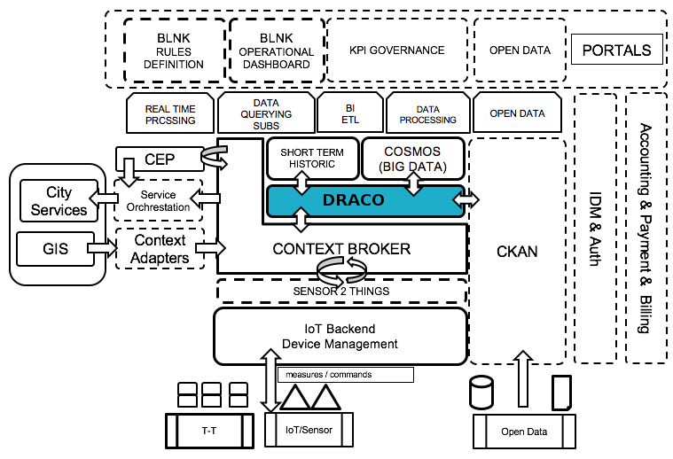

# FIWARE Draco

 

## Table of Contents

-   [What is Draco?](#what-is-draco)
-   [Terminology](#terminology)
-   [Why use Draco?](#why-use-draco)
-   [Draco place in FIWARE architecture](#draco-place-in-fiware-architecture)
-   [How to Deploy?](#how-to-deploy)
-   [Usage: Overview](#usage-overview)
-   [Training Courses](#training-courses)
-   [Testing](#testing)
-   [Quality Assurance](#quality-assurance)
-   [Roadmap](#roadmap)
-   [Maintainers](#maintainers)
-   [Licensing](#licensing)
-   [Reporting issues and contact information](#reporting-issues-and-contact-information)

## What is Draco?

This project is part of [FIWARE](http://fiware.org), as part of the Core Context Management Chapter .

Draco is a is an easy to use, powerful, and reliable system to process and distribute data. Internally, Draco is based
on [Apache NiFi](https://nifi.apache.org/docs.html), NiFi is a dataflow system based on the concepts of flow-based
programming. It supports powerful and scalable directed graphs of data routing, transformation, and system mediation
logic. It was built to automate the flow of data between systems. While the term 'dataflow' is used in a variety of
contexts, we use it here to mean the automated and managed flow of information between systems.

| :books: [Documentation](https://fiware-draco.rtfd.io) | :whale: [Docker Hub](https://hub.docker.com/r/ging/fiware-draco) | :dart: [Roadmap](docs/roadmap.md) |
| ----------------------------------------------------- | ---------------------------------------------------------------- | --------------------------------- |

### Terminology

In order to talk about Draco, there are a few key terms that readers should be familiar with. We will explain those
NiFi-specific terms here, at a high level.

**FlowFile:** Each piece of "User Data" (i.e., data that the user brings into NiFi for processing and distribution) is
referred to as a FlowFile. A FlowFile is made up of two parts: Attributes and Content. The Content is the User Data
itself. Attributes are key-value pairs that are associated with the User Data.

**Processor:** The Processor is the NiFi component that is responsible for creating, sending, receiving, transforming,
routing, splitting, merging, and processing FlowFiles. It is the most important building block available to NiFi users
to build their dataflows.

## Why use Draco?

Draco is designed to run specific set of processors and templates for persistence context data to multiple sinks.

Current stable release is able to persist the following sources of data in the following third-party storages:

-   NGSI-like context data in:
    -   [MySQL](https://www.mysql.com/), the well-known relational database manager.
    -   [MongoDB](https://www.mongodb.org/), the NoSQL document-oriented database.
    -   [PostgreSQL](http://www.postgresql.org/), the well-known relational database manager.

## Draco place in FIWARE architecture

Draco plays the role of a connector between Orion Context Broker (which is a NGSI source of data) and many external and
FIWARE storages like MySQL, MongoDB

## How to Deploy?

The most easy way to deploy Draco is running the container available on DockerHub.

Start a container for this image by typing in a terminal:

     $ docker run --name draco -p 8080:8080 -p 5050:5050 -d ging/fiware-draco

However if you want to have a custom installation please go to the **Installation and Administration Guide** at
[readthedocs.org](docs/installation_and_administration_guide/README.md)

## Usage: Overview

The best way to start with Draco is following the **Quick Start Guide** found at readthedocs.org and it provides a good
documentation summary ([Draco](docs/quick_start_guide.md)).

Nevertheless, both the **Installation and Administration Guide** also found at
[readthedocs.org](docs/installation_and_administration_guide/README.md) cover more advanced topics.

The **Processors Catalogue** completes the available documentation for Draco
([Draco](docs/processors_catalogue/README.md)).

## Training courses

### Academy Courses

Some lessons on Draco Fundamentals will be offered soon in the
[FIWARE Academy](https://fiware-academy.readthedocs.io/en/latest) .

### Examples

Several examples are provided to facilitate getting started with GE. They are hosted in the official documentation at
[Read the Docs](https://fiware-draco.readthedocs.io/en/latest/quick_start_guide/index.html).

## Testing

In order to test the code:

    $mvn clean test -Dtest=Test* cobertura:cobertura coveralls:report -Padd-dependencies-for-IDEA

## Quality Assurance

This project is part of FIWARE and has been rated as follows:

-   **Version Tested:** TBD
-   **Documentation:** TBD
-   **Responsiveness:** TBD
-   **FIWARE Testing:** TBD

## Roadmap

The list of features that are planned for the subsequent release are available in the
[ROADMAP](https://github.com/ging/fiware-draco/blob/develop/docs/roadmap.md) file.

## Maintainers

[@anmunoz](https://github.com/anmunoz).

## Licensing

Draco Except as otherwise noted this software is licensed under the Apache License, Version 2.0 Licensed under the
Apache License, Version 2.0 (the "License"); you may not use this file except in compliance with the License. You may
obtain a copy of the License at `http://www.apache.org/licenses/LICENSE-2.0` Unless required by applicable law or agreed
to in writing, software distributed under the License is distributed on an "AS IS" BASIS, WITHOUT WARRANTIES OR
CONDITIONS OF ANY KIND, either express or implied. See the License for the specific language governing permissions and
limitations under the License.

## Reporting issues and contact information

Any doubt you may have, please refer to the
[Draco Core Team](docs/installation_and_administration_guide/issues_and_contact.md).
