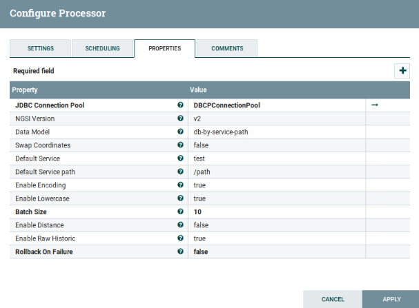

# NGSIToCarto
   
## Functionality

NGSIToCarto is a processor designed to persist NGSI-like context data within a [PostgreSQL server](https://www.postgresql.org/) to be read
by [Carto](https://carto.com/). These context data usually come from the [Orion Context Broker](https://github.com/telefonicaid/fiware-orion) instance
, but could be any other system speaking the <i>NGSI language</i>.

Independently of the data generator, NGSI context data is always transformed into internal `NGSIEvent` objects at Draco sources. In the end, the information within these events must be mapped into specific PostgreSQL data structures.

[Top](#top)

### Mapping NGSI events to `NGSIEvent` objects
Notified NGSI events (containing context data) are transformed into `NGSIEvent` objects (for each context element a `NGSIEvent` is created; such an event is a mix of certain headers and a `ContextElement` object), independently of the NGSI data generator or the final backend where it is persisted.

This is done at the Draco-ngsi Http listeners (in Flume jergon, sources) thanks to [`NGSIRestHandler`](ngsi_rest_handler.md). Once translated, the data (now, as `NGSIEvent` objects) is put into the internal channels for future consumption (see next section).

[Top](#top)

### Mapping `NGSIEvent`s to PostgreSQL data structures
PostgreSQL organizes the data in schemas inside a database that contain tables of data rows. Such organization is exploited by `NGSIToPostgreSQL` each time a `NGSIEvent` is going to be persisted.

[Top](#top)

#### PostgreSQL databases naming conventions
Previous to any operation with PostgreSQL you need to create the database to be used.

It must be said [PostgreSQL only accepts](https://www.postgresql.org/docs/current/static/sql-syntax-lexical.html#SQL-SYNTAX-IDENTIFIERS) alphanumeric characters and the underscore (`_`). This leads to  certain [encoding](#section2.3.4) is applied depending on the `enable_encoding` configuration parameter.

PostgreSQL [databases name length](http://www.postgresql.org/docs/current/static/sql-syntax-lexical.html#SQL-SYNTAX-IDENTIFIERS) is limited to 63 characters.

Also, because of a Carto's requirement, the name must begin with a letter (a-z).

[Top](#top)

#### PostgreSQL schemas naming conventions
A schema named as the notified `fiware-service` header value (or, in absence of such a header, the defaulted value for the FIWARE service) is created (if not existing yet).

It must be said [PostgreSQL only accepts](https://www.postgresql.org/docs/current/static/sql-syntax-lexical.html#SQL-SYNTAX-IDENTIFIERS) alphanumeric characters and the underscore (`_`). This leads to  certain [encoding](#section2.3.4) is applied depending on the `enable_encoding` configuration parameter.

PostgreSQL [schemas name length](http://www.postgresql.org/docs/current/static/sql-syntax-lexical.html#SQL-SYNTAX-IDENTIFIERS) is limited to 63 characters.

Also, because of a Carto's requirement, the name must begin with a letter (a-z).
[Top](#top)

#### PostgreSQL tables naming conventions
The name of these tables depends on the configured data model (see the [Configuration](#section2.1) section for more details):

-   Data model by service path (`data_model=dm-by-service-path`). As the data model name denotes, the notified FIWARE service path (or the configured one as default in [`NGSIRestHandler`](./ngsi_rest_handler.md)) is used as the name of the table. This allows the data about all the NGSI entities belonging to the same service path is stored in this unique table. The only constraint regarding this data model is the FIWARE service path cannot be the root one (`/`).
-   Data model by entity (`data_model=dm-by-entity`). For each entity, the notified/default FIWARE service path is concatenated to the notified entity ID and type in order to compose the table name. If the FIWARE service path is the root one (`/`) then only the entity ID and type are concatenated.

It must be said [PostgreSQL only accepts](https://www.postgresql.org/docs/current/static/sql-syntax-lexical.html#SQL-SYNTAX-IDENTIFIERS) alphanumeric characters and the underscore (`_`). This leads to  certain [encoding](#section2.3.4) is applied depending on the `enable_encoding` configuration parameter.

PostgreSQL [tables name length](http://www.postgresql.org/docs/current/static/sql-syntax-lexical.html#SQL-SYNTAX-IDENTIFIERS) is limited to 63 characters.

The following table summarizes the table name composition (old encoding):

| FIWARE service path | `db-by-service-path` | `db-by-entity` |
|---|---|---|
| `/` | N/A | `<entityId>_<entityType>` |
| `/<svcPath>` | `<svcPath>` | `<svcPath>_<entityId>_<entityType>` |

Using the new encoding:

| FIWARE service path | `db-by-service-path` | `db-by-entity` |
|---|---|---|
| `/` | `x002f` | `x002fxffff<entityId>xffff<entityType>` |
| `/<svcPath>` | `x002f<svcPath>` | `x002f<svcPath>xffff<entityId>xffff<entityType>` |

Please observe the concatenation of entity ID and type is already given in the `notified_entities`/`grouped_entities` header values (depending on using or not the grouping rules, see the [Configuration](#section2.1) section for more details) within the `NGSIEvent`.

[Top](#top)

## Raw-based storing

It must be enabled the `enable_raw` parameter, unless `enable_distance` is not activated, so `enable_raw` will be enabled by default. It will have the following fields:

-   `cartodb_id`: This column is used as the primary key of the table
-   `RecvTime`: UTC timestamp in human-redable format ([ISO 8601](http://en.wikipedia.org/wiki/ISO_8601)).
-   `RecvTimeTs`: Timestamp in milliseconds.
-   `FiwareServicePath`: Notified fiware-servicePath, or the default configured one if not notified.
-   `entityId`: Notified entity identifier.
-   `entityType`: Notified entity type.
-   `the_geom`: Geo-localized point that contains the longitude and latitude, of PostGIS Geometry type. It use the reference sistem EPSG 4326. It must be created by means of the ST_Point () function. It can be of three types:
    -   `geo:point`: a point.
    -   `geo:json`: GeoJSON representing a point.
-   `the_geom_webmercator`:Exactly the same as `the_geom` bt changing the EPSH sistem reference to 3857.
-   For each not-geolocated attribute, the insert will contain two additional field, one named with the `attrName` received and another with the metadata.

[Top](#top)
 
## Distance-based storing

It must be enabled the `enable_distance` parameter. It will contain the following fields:

-   `cartodb_id`: This column is used as the primary key of the table
-   `recvTime`: UTC timestamp in human-redable format ([ISO 8601](http://en.wikipedia.org/wiki/ISO_8601)).
-   `recvTimeTs`: Timestamp in milliseconds.
-   `fiwareServicePath`: Notified fiware-servicePath, or the default configured one if not notified.
-   `entityId`: Notified entity identifier.
-   `entityType`: Notified entity type.
-   `the_geom`: Geo-localized point that contains the longitude and latitude, of PostGIS Geometry type. It use the reference sistem EPSG 4326. It must be created by means of the ST_Point () function. It can be of three types:
    -   `geo:point`: a point.
    -   `geo:json`: GeoJSON representing a point.
-   `the_geom_webmercator`:Exactly the same as `the_geom` bt changing the EPSH sistem reference to 3857.
-   `stageDistance`: Distane between the new geopoint and the previous one.
-   `stageTime`: The elapsed time when moving from the new geopoint and the previous one.
-   `stageSpeed`: Division between the `stageDistance` and the `stageTime`.
-   `sumDistance`: Average stage distance. Division of the sum of the stage distances with the number of stages.
-   `sumTime`: Average stage time. Division of the sum of the stage times with the number of stages.
-   `sumSpeed`: Average stage speed. Division of the sum of the stage speeds with the number of stages.
-   `sum2Distance`: variance of the stage distances. Division of the square root of the sum of stage distances divided by the number of stages.
-   `sum2Time`: variance of the stage times. Division of the square root of the sum of stage times divided by the number of stages.
-   `sum2Speed`: variance of the stage speeds. Division of the square root of the sum of stage speeds divided by the number of stages.
-   `maxDistance`: Maximum of the stage distances.
-   `minDistance`: Minimum of the stage distances.
-   `maxTime`: Maximum of the stage times.
-   `minTime`: Minimum of the stage times.
-   `maxSpeed`: Maximum of the stage speeds.
-   `minSpeed`: Minimum of the stage speeds.

[Top](#top)

### Example
#### `NGSIEvent`
Assuming the following `NGSIEvent` is created from a notified NGSI context data (the code below is an <i>object representation</i>, not any real data format):

    URL=$1
   
    curl $URL -v -s -S --header 'Content-Type: application/json; charset=utf-8' --header 'Accept: application/json' --header "Fiware-Service: qsg" --header "Fiware-ServicePath: /path" -d @- <<EOF

    {
       "subscriptionId": "51c0ac9ed714fb3b37d7d5a8",
       "data": [{
           "location": {
               "type": "geo:point",
               "value": "40.4, -3.6",
               "metadata": {}
           },
           "temperature":{
                "type":"string",
                "value" 28,
                "metadata":{}
           },
   
           "type": "geo",
           "id": "eventoGEO"
       }]
    }
    EOF

[Top](#top)

## Database, schema and table names

The PostgreSQL database name will be of the user's choice.
The name of the schema table is qsg.
The PostgreSQL table names will be, depending on the configured data model, the following ones (old encoding):

| FIWARE service path | `db-by-service-path` | `db-by-entity` |
|---|---|---|
| `/` | N/A | `eventoGEO_geo` |
| `/path` | `path` | `path_eventoGEO_geo` |

Using the new encoding:

| FIWARE service path | `db-by-service-path` | `db-by-entity` |
|---|---|---|
| `/` | `x002f` | `x002fxffffeventoGEOxffffgeo` |
| `/path` | `x002f4path` | `x002fpathxffffeventoGEOxffffgeo` |

[Top](#top)

## Raw-based storing

    $ sudo docker exec -it db_1 /bin/bash
    
    root@4ba049a562bd:/# psql postgres postgres

    postgres# \dn
       List of schemas
    +----------+----------+   
    |   Name   |  Owner   |
    +----------+----------+
    | public   | postgres |
    +----------+----------+
    | qsg      | postgres |
    +----------+----------+ 
    (2 rows)

    postgres=# \dt qsg.*
    
                   List of relations
    +----------+-------------------+-------+----------+               
    |  Schema  |       Name        | Type |  Owner    |
    -----------+-------------------+------+-----------+
    | qsg      |     x002fpath     | table| postgres  |
    +----------+-------------------+------+-----------+
    (1 row)

    postgresql=# select * from qsg.x002fpath;
    
     |cartodb_id    | recvtimets          |    recvtime         | fiwareservicepath | entityid          | entitytype | attrtype  |                      the_geom                      |               the_geom_webmercator                 | temperature | temperature_md |
     +--------------+---------------------+---------------------+-------------------+-------------------+------------+-----------+----------------------------------------------------+----------------------------------------------------+-------------+----------------+
     |1             |       1559895851662 | 06/07/2019 10:24:11 | path              | eventoGEO         | geo        | geo:point | 0101000020E61000003333333333B348406666666666661EC0 |  0101000020110F00003333333333B348406666666666661EC0| 28          |    []          |
     (1 row)                                                                                 
    

In addition, the same values but for the insertion in Carto

     curl "https://myusername.cartodb.com/api/v2/sql?q=select * from x002f4pathxffffeventoGEOxffffgeo&api_key=..."
     {
       "rows": [
         {
           "cartodb_id": 1,
           "the_geom": "0101000020E61000003333333333B348406666666666661EC0",
           "the_geom_webmercator": "0101000020110F00003333333333B348406666666666661EC0",
           "entitytype": "geo",
           "entityid": "eventoGEO",
           "fiwareservicepath": "/path",
           "recvtime": "2016-04-21T10:34:23.423Z",
           "recvTimeTs":"1559895851662",
           "temperature": "28"
     
         }
       ],
       "fields": {
         "cartodb_id": {
           "type": "integer"
         },
         "the_geom": {
           "type": "geometry"
         },
         "the_geom_webmercator": {
           "type": "geometry"
         },
         "entitytype": {
           "type": "string"
         },
         "entityid": {
           "type": "string"
         },
         "fiwareservicepath": {
           "type": "string"
         },
         "recvtime": {
           "type": "string"
         },
         "recvTimeTs": {
           "type":"string" 
         }
         "temperature": {
            "type":"string"
         }
       },
       "total_rows": 1
     }

    
[Top](#top)

## Distance-based storing

It must be enabled the `enable_distance` parameter, and `enable_raw` set to disabled.
In order to show how calculations are done, another NGSI event will be notified.

    $ sudo docker exec -it db_1 /bin/bash
    
    root@4ba049a562bd:/# psql postgres postgres

    postgres# \dn
       List of schemas
    +----------+----------+   
    |   Name   |  Owner   |
    +----------+----------+
    | public   | postgres |
    +----------+----------+
    | qsg      | postgres |
    +----------+----------+ 
    (2 rows)

    postgres=# \dt qsg.*
    
                   List of relations
    +----------+-------------------+-------+----------+               
    |  Schema  |       Name        | Type |  Owner    |
    -----------+-------------------+------+-----------+
    | qsg      |     x002fpath     | table| postgres  |
    +----------+-------------------+------+-----------+
    (1 row)
    
    postgres=# select * from qsg.x002fpath;
    
     cartodb_id |  recvtimets   | fiwareservicepath | entityid  | entitytype |                      the_geom                      |                the_geo m_webmercator               |  stagedistance  | stagetime |    stagespeed    |   sumdistance   | sumtime |     sumspeed     |   sum2distance   |  sum2time  |    sum2speed     |   maxdistance   |   mindistance   | maxtime |    mintime    |     maxspeed     |     minspeed     | numsamples 
    ------------+---------------+-------------------+-----------+------------+----------------------------------------------------+----------------------------------------------------+-----------------+-----------+------------------+-----------------+---------+------------------+------------------+------------+------------------+-----------------+-----------------+---------+---------------+------------------+------------------+------------
              1 | 1559908745414 | /path             | eventoGEO | geo        | 0101000020E61000003333333333B348406666666666661EC0 | 0101000020110F00003333333333B348406666666666661EC0 |               0 |         0 |                0 |               0 |       0 |                0 |                0 |     0      |                0 |         1.4e-45 |   3.4028235e+38 | 1.4e-45 | 3.4028235e+38 |          1.4e-45 |    3.4028235e+38 |          1
    ------------+---------------+-------------------+-----------+------------+----------------------------------------------------+----------------------------------------------------+-----------------+-----------+------------------+-----------------+---------+------------------+------------------+------------+------------------+-----------------+-----------------+---------+---------------+------------------+------------------+------------          
              2 | 1559908831520 | /path             | eventoGEO | geo        | 0101000020E61000003333333333B34B4033333333333323C0 | 0101000020110F00003333333333B34B4033333333333323C0 | 696473.71816969 |     86106 | 8.08856198371414 | 696473.71816969 |   86106 | 8.08856198371414 | 485075640101.113 | 7414243236 | 65.4248349643857 | 696473.71816969 | 696473.71816969 |   86106 |         86106 | 8.08856198371414 | 8.08856198371414 |          2
    (2 rows)

In addition, the same values but for the insertion in Carto
    
    curl "https://myusername.cartodb.com/api/v2/sql?q=select * from x002f4pathxffffeventoGEOxffffgeo&api_key=abcdef0123456789"
    {
      "rows": [
        {
          "cartodb_id": 1,
          "the_geom": "0101000020E61000003333333333B348406666666666661EC0",
          "the_geom_webmercator": "0101000020110F00003333333333B348406666666666661EC0",
          "entitytype": "geo",
          "entityid": "eventoGEO",
          "fiwareservicepath": "/path",
          "recvtime": "2016-04-21T10:34:23.423Z",
          "recvTimeTs":"1559895851662",
          "numsamples": 1,
          "minspeed": Infinity,
          "mintime": Infinity,
          "mindistance": Infinity,
          "maxspeed": -Infinity,
          "maxtime": -Infinity,
          "maxdistance": -Infinity,
          "sums2peed": 0,
          "sum2time": 0,
          "sum2distance": 0,
          "sumspeed": 0,
          "sumtime": 0,
          "sumdistance": 0,
          "stagespeed": 0,
          "stagetime": 0,
          "stagedistance": 0,
    
        },
        {
          "cartodb_id": 2,
          "the_geom": ""cartodb_id": 1,
          "the_geom": "0101000020E61000003333333333B34B4033333333333323C0",
          "the_geom_webmercator": "0101000020110F00003333333333B34B4033333333333323C0",
          "entitytype": "geo",
          "entityid": "eventoGEO",
          "fiwareservicepath": "/path",
          "recvtime": "2016-04-21T10:34:23.423Z",
          "recvTimeTs":"1559895851662",
          "numsamples": 1,
          "minspeed": 8.08856198371414,
          "mintime": 86106,
          "mindistance": 696473.71816969,
          "maxspeed": 8.08856198371414,
          "maxtime": 86106,
          "maxdistance": 696473.71816969,
          "sum2speed": 65.4248349643857,
          "sum2time": 7414243236,
          "sum2distance": 485075640101.113,
          "sumspeed": 8.08856198371414,
          "sumtime": 86106,
          "sumdistance": 696473.71816969,
          "stagespeed": 8.08856198371414,
          "stagetime": 86106,
          "stagedistance": 696473.71816969,
        }
            ],
            "fields": {
              "cartodb_id": {
                "type": "integer"
              },
              "the_geom": {
                "type": "geometry"
              },
              "the_geom_webmercator": {
                "type": "geometry"
              },
              "attrmd": {
                "type": "string"
              },
              "entitytype": {
                "type": "string"
              },
              "entityid": {
                "type": "string"
              },
              "fiwareservicepath": {
                "type": "string"
              },
              "recvtime": {
                "type": "string"
              },
              "recvTimeTs": {
                "type":"string"
              },
              "numsamples": {
                "type": "number"
              },
              "minspeed": {
                "type": "number"
              },
              "mintime": {
                "type": "number"
              },
              "mindistance": {
                "type": "number"
              },
              "maxspeed": {
                "type": "number"
              },
              "maxtime": {
                "type": "number"
               },
              "maxdistance": {
                "type": "number"
               },
              "sumspeed2": {
                "type": "number"
               },
              "sumtime2": {
               "type": "number"
               },
              "sumdistance2": {
               "type": "number"
               },
              "sumspeed": {
               "type": "number"
               },
              "sumtime": {
               "type": "number"
               },
              "sumdistance": {
               "type": "number"
               },
              "stagespeed": {
               "type": "number"
               },
              "stagetime": {
               "type": "number"
               },
              "stagedistance": {
               "type": "number"
               },
            },
           "total_rows": 2
     }

              

     
    
  
## Administration guide
## Configuration

NGSIToCarto is configured through the following parameters
(Parameters in bold are required):

|Name                     |Default value      |Allowable values                  |Description                                                                                                                                                                                                                                                                                                         |              
|-------------------------|-------------------|----------------------------------|--------------------------------------------------------------------------------------------------------------------------------------------------------------------------------------------------------------------------------------------------------------------------------------------------------------------|  
|**JDBC Connection Pool** |No                 |                                  |Controller service for connecting to a specific database engine                                                                                                                                                                                                                                                     |  
|Data model               |db-by_service-path | db-by_service-path, db-by-entity |The data model for creating tha tables and schemas                                                                                                                                                                                                                                                                  |
|NGSI version             |v2                 |v2                                |NGSI version you want to use                                                                                                                                                                                                                                                                                        |
|Default service          |test               |                                  |In case there is not Fiware-Service in the context broker, this value will be set                                                                                                                                                                                                                                   |
|Default service path     |/path              |                                  |In case there is not Fiware-ServicePath in the context broker, this value will be set                                                                                                                                                                                                                               |
|Enable encoding          |true               |true, false                       |true enables the new encoding, false enables old encoding                                                                                                                                                                                                                                                           |
|Enable raw historic      |true               |true, false                       |true enables raw-based storing                                                                                                                                                                                                                                                                                      |                              
|Enable distance historic |false              |true, false                       |true enables distance-based storing                                                                                                                                                                                                                                                                                 |                                          
|Swap coordinates         |false              |true, false                       |true changes position between latitude and longitude                                                                                                                                                                                                                                                                |
|Enable lowercase         |true               |true, false                       |true for creating the Schema and Tables name with lowercase                                                                                                                                                                                                                                                         |                                  
|**Batch size**           |10                 |                                  |The preferred number of FlowFiles to put to the database in a single transaction                                                                                                                                                                                                                                    |              
|Transaction timeout      |no                 |30                                |Specify how errors are going to be handled. By default(false), if there is an error the FlowFile will be routed to "failure" or "retry". If it is enabled the failure FlowFiles will stay in the input relation without penalizing it and being processed repeatedly until it gets processed successfully or removed.| 

An example of this configuration can be:

#### Important notes
#### About the encoding
Until version 1.2.0 (included), Draco applied a very simple encoding:

-   All non alphanumeric characters were replaced by underscore, `_`.
-   The underscore was used as concatenator character as well.
-   The slash, `/`, in the FIWARE service paths is ignored.

From version 1.3.0 (included), Draco applies this specific encoding tailored to PostgreSQL data structures:

-   Lowercase alphanumeric characters are not encoded.
-   Upercase alphanumeric characters are encoded.
-   Numeric characters are not encoded.
-   Underscore character, `_`, is not encoded.
-   Equals character, `=`, is encoded as `xffff`.
-   All other characters, including the slash in the FIWARE service paths, are encoded as a `x` character followed by the [Unicode](http://unicode-table.com) of the character.
-   User defined strings composed of a `x` character and a Unicode are encoded as `xx` followed by the Unicode.
-   `xffff` is used as concatenator character.

Despite the old encoding will be deprecated in the future, it is possible to switch the encoding type through the `enable_encoding` parameter as explained in the [configuration](#section2.1) section.

[Top](#top)

## About the distance-based storing

In case that `enable_distance` is enabled and the table of the database is empty, the values of the parameters `stageDistance`, `stageTime`, `stageSpeed`, `sumDistance`, `sumTime`,`sumSpeed`,`sumDistance2`, `sumTime2` and `sumSpeed2` are set by default to 0 and the values of `maxDistance`,`minDistance`, `maxTime`,`minTime`,`maxSpeed` and `minSpeed` are set to infinity in the case of
minimum values and in the other case to -infinity.

If the table is not empty, the calculations of distance, speed and time will be done.

## EPSG system reference

Parameters `the_geom` and `the_geom_webmercator` use a system reference EPSG, that is a code in order to be read by Carto. In case of `the_geom` EPSG 4326 is the horiontal component for a 3D system
, it is used by the nagevation system GPS. In the case of `the_geom_webmercator`, is used EPSG 3857 useful for the creation of web maps.
