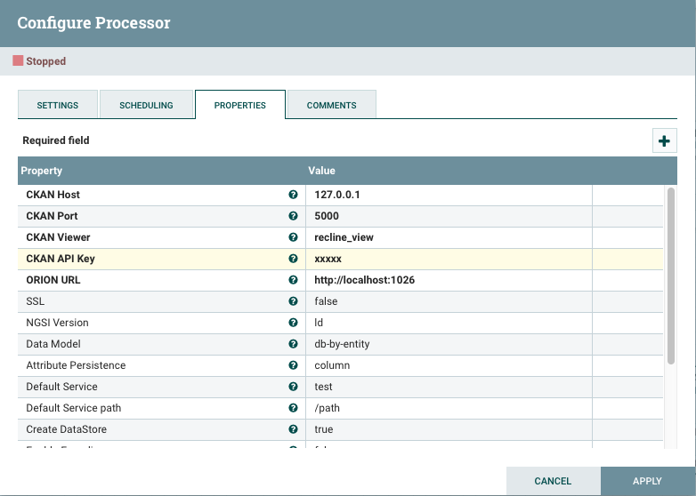

# NGSIToCKAN
Content:

-   [Functionality](#section1)
    -   [Mapping NGSI-LD events to `NGSI-LDEvent` objects](#section1.1)
    -   [Mapping `NGSI-LDEvents` to CKAN data structures](#section1.2)
        -   [Organizations naming conventions](#section1.2.1)
        -   [Package/dataset naming conventions](#section1.2.2)
        -   [Resource naming conventions](#section1.2.3)
        -   [Column-like storing](#section1.2.4)
    -   [Example](#section1.3)
        -   [NGSI-LDEvent](#section1.3.1)
        -   [Organization, dataset and resource names](#section1.3.2)
        -   [Column-like storing](#section1.3.3)
-   [Administration guide](#section2)
    -   [Configuration](#section2.1)
-   [Use cases](#section2.2)
-   [Important notes](#section2.3)
    -   [About the persistence mode](#section2.3.1)
    -   [About the encoding](#section2.3.3)
-   [Programmers guide](#section3)
    -   [`NGSICKANSink` class](#section3.1)

## Functionality
`NGSIToCKAN`, is a processor designed to persist NGSI-LD-like context data events within a [CKAN](http://ckan.org/) server.Usually, such a context data is notified by a
Context Boker ([Orion Context Broker](https://github.com/telefonicaid/fiware-orion),[Orion-LD Context Broker](https://github.com/FIWARE/context.Orion-LD),[Scorpio Broker](https://github.com/ScorpioBroker/ScorpioBroker) ) instance, but could be any other system speaking the _NGSI language_.

Independently of the data generator, NGSI-LD context data is always transformed into internal `NGSI-LDEvent` objects at Draco sources. In the end, the information within these events must be mapped into specific CKAN data structures.

Next sections will explain this in detail.

[Top](#top)

### Mapping NGSI-LD events to `NGSI-LDEvent` objects
Notified NGSI-LD events (containing context data) are transformed into `NGSI-LDEvent` objects (for each context element a `NGSI-LDEvent` is created; such an event is a mix of certain headers and a `ContextElement` object), independently of the NGSI-LD data generator or the final backend where it is persisted.

This is done at the Draco-ngsi Http listeners (in NiFi, processors) thanks to NGSIRestHandler. Once translated, the data (now, as NGSIEvent objects) is put into the internal channels for future consumption (see next section).
[Top](#top)

### Mapping `NGSI-LDEvent`s to CKAN data structures
[CKAN](http://docs.ckan.org/en/latest/user-guide.html) organizes the data in organizations containing packages or datasets; each one of these packages/datasets contains several resources whose data is finally stored in a PostgreSQL database (CKAN Datastore) or plain files (CKAN Filestore). Such organization is exploited by `NGSICKANSink` each time a `NGSI-LDEvent` is going to be persisted.

[Top](#top)

#### Organizations naming conventions
-   Data model by entity (`data_model=dm-by-entity`). An organization named as the notified `fiware-service` header value (or, in absence of such a header, the defaulted value for the FIWARE service) is created (if not existing yet).
Since based in [PostgreSQL only accepts](https://www.postgresql.org/docs/current/static/sql-syntax-lexical.html#SQL-SYNTAX-IDENTIFIERS), it must be said only alphanumeric characters and the underscore (`_`) are accepted. The hyphen ('-') is also accepted. This leads to certain [encoding](#section2.3.3) is applied depending on the `enable_encoding` configuration parameter.
Nevertheless, different than PostgreSQL, [organization lengths](http://docs.ckan.org/en/latest/api/#ckan.logic.action.create.organization_create) may be up to 100 characters (minimum, 2 characters).

-   Data model by entity id (`data_model=dm-by-entity-id`). The organization name will take the value of the notified header `fiware-service`. Note that in this case, encoding is never applied.

The following table summarizes the organization name composition:

| `dm-by-entity` | `dm-by-entity-id` |
|---|---|
| `<fiware-service>` | `<fiware-service>` | 

[Top](#top)

#### Packages/datasets naming conventions
-   Data model by entity (`data_model=dm-by-entity`). A package/dataset named as the notified `fiware-service`  header value (or, in absence of such header, the defaulted value for the FIWARE service ) is created (if not existing yet) in the above organization.
Since based in [PostgreSQL only accepts](https://www.postgresql.org/docs/current/static/sql-syntax-lexical.html#SQL-SYNTAX-IDENTIFIERS), it must be said only alphanumeric characters and the underscore (`_`) are accepted. The hyphen ('-') is also accepted. This leads to  certain [encoding](#section2.3.3) is applied depending on the `enable_encoding` configuration parameter
Nevertheless, different than PostgreSQL, [dataset lengths](http://docs.ckan.org/en/latest/api/#ckan.logic.action.create.package_create) may be up to 100 characters (minimum, 2 characters).

-   Data model by entity id (`data_model=dm-by-entity-id`). A package/dataset name always take the entity ID. Such a name is already given in the NGSI-LDEvent values, see the [Configuration](#section2.1) section for more details) within the the `NGSI-LDEvent`. Note that in this case, encoding is never applied.

The following table summarizes the package name composition:

| `dm-by-entity` | `dm-by-entity-id` |
|---|---|
| `<fiware-service>` | `<entityId>` | 

[Top](#top)

#### Resources naming conventions
The resource name depends on the configured data model (see the [Configuration](#section2.1) section for more details):

-   Data model by entity (`data_model=dm-by-entity`). A resource name always take the concatenation of the entity ID and type. Such a name is already given in the `notified_entities`/`grouped_entities` header values (depending on using or not the grouping rules, see the [Configuration](#section2.1) section for more details) within the `NGSI-LDEvent`.

-   Data model by entity id (`data_model=dm-by-entity-id`). A resource name always take the entity ID. Such a name is already given in the NGSI-LDEvent values, see the [Configuration](#section2.1) section for more details) within the the `NGSI-LDEvent`. Note that in this case, encoding is never applied.

It must be noticed a CKAN Datastore (and a viewer) is also created and associated to the resource above. This datastore, which in the end is a PostgreSQL table, will hold the persisted data.

Since based in [PostgreSQL](https://www.postgresql.org/docs/current/static/sql-syntax-lexical.html#SQL-SYNTAX-IDENTIFIERS), it must be said only alphanumeric characters and the underscore (`_`) are accepted. The hyphen ('-') is also accepted. This leads to  certain [encoding](#section2.3.3) is applied depending on the `enable_encoding` configuration parameter.

Despite there is no real limit on the resource names, Draco will keep limiting their lengths up to 100 characters (minimum, 2 characters), accordingly to what's done with organization and package names.

The following table summarizes the resource name composition:

| `dm-by-entity` | `dm-by-entity-id` |
|---|---|
| `<entityId>_<entityType>` | `<entityId>` |

[Top](#top)

#### Column-like storing
Regarding the specific data stored within the datastore associated to the resource, if `attr_persistence` parameter is set to `column` then a single line is composed for the whole notified entity, containing the following fields:

-   `recvTimeTs` UTC timestamp in human-redable format ([ISO 8601](http://en.wikipedia.org/wiki/ISO_8601)).
-    `entityId`: Notified entity identifier.
-    `entityType`: Notified entity type.
-    For each notified property/relationship, a field named as the property/relationship is considered. This field will store the property/relationship values along the time, if no unique value is presented, the values will be stored like a JSON string.

[Top](#top)

### Example
#### `NGSI-LDEvent`
Assuming the following `NGSI-LDEvent` is created from a notified NGSI-LD context data (the code below is an <i>object representation</i>, not any real data format):

    ngsi-notification=
    headers={
       fiware-service=opniot,
       transaction-id=1234567890-0000-1234567890,
       correlation-id=1234567890-0000-1234567890,
       timestamp=1234567890,
    },
    {
            "id": "urn:ngsi:ld:OffStreetParking:Downtown1",
            "type": "OffStreetParking",
            "@context": [
            "http://example.org/ngsi-ld/parking.jsonld",
            "https://uri.etsi.org/ngsi-ld/v1/ngsi-ld-core-context.jsonld"],
            "name": {
            "type": "Property",
               "value": "Downtown One"
            },
            "availableSpotNumber": {
                "type": "Property",
                "value": 122,
                "observedAt": "2017-07-29T12:05:02Z",
                "reliability": {
                    "type": "Property",
                    "value": 0.7
                },
                "providedBy": {
                    "type": "Relationship",
                    "object": "urn:ngsi-ld:Camera:C1"
                }
            },
            "totalSpotNumber": {
                "type": "Property",
                "value": 200
            },
                "location": {
                "type": "GeoProperty",
                "value": {
                    "type": "Point",
                    "coordinates": [-8.5, 41.2]
                }
            }
    }

[Top](#top)

#### Organization, dataset and resource names
Given the above example and using the old encoding, these are the CKAN elements created

-   Orgnaization: `openiot`.
-   Package: `openiot`.
-   Resource: `urn_ngsi_ld_OffStreetParking_Downtown1`.

Using the new encdoing:

-   Orgnaization: `vehicles`.
-   Package: `vehicles`.
-   Resource: `urnxffffngsixffffldxffffOffStreetParkingxffffDowntown1`.

[Top](#top)

#### Column-like storing
If `attr_persistence=colum` then `NGSICKANSink` will persist the data within the body as:

    $ curl -s -S -H "Authorization: myapikey" "http://130.206.83.8:80/api/3/action/datastore_search?resource_id=611417a4-8196-4faf-83bc-663c173f6986"
    {
        "help": "Search a DataStore resource...",
        "success": true,
        "result": {
            "resource_id": "611417a4-8196-4faf-83bc-663c173f6986",
            "fields": [
                {
                    "type": "int4",
                    "id": "_id"
                },
                {
                    "type": "timestamp",
                    "id": "recvTime"
                },
                {
                    "type": "text",
                    "id": "entityID"
                },
                {
                    "type": "text",
                    "id": "entityType"
                },
                {
                    "type": "text",
                    "id": "availableSpotNumber"
                },
                {
                    "type": "text",
                    "id": "availableSpotNumber_observedAt"
                },
                {
                    "type": "text",
                    "id": "availableSpotNumber_reliability"
                },
                {
                    "type": "text",
                    "id": "availableSpotNumber_providedBy"
                },
                {
                    "type": "text",
                    "id": "name"
                },
                {
                    "type": "text",
                    "id": "location"
                },
                {
                    "type": "text",
                    "id": "totalSpotNumber"
                }
            ],
            "records": [ 
                {
                    "recvTime":"2020-09-21T23:54:13.394Z",
                    "entityId":"urn:ngsi:ld:OffStreetParking:Downtown1",
                    "entityType":"OffStreetParking","availableSpotNumber":"122",
                    "availableSpotNumber_observedAt":"122",
                    "availableSpotNumber_reliability":"0.7",
                    "availableSpotNumber_providedBy":"urn:ngsi-ld:Camera:C1",
                    "name":"Downtown One",
                    "location":'{"type":"Point","coordinates":[-8.5,41.2]}',
                    "totalSpotNumber":"200"
                }
             ],
            "_links": {
                "start": "/api/3/action/datastore_search?resource_id=611417a4-8196-4faf-83bc-663c173f6986",
                "next": "/api/3/action/datastore_search?offset=100&resource_id=611417a4-8196-4faf-83bc-663c173f6986"
            },
            "total": 1
        }
    }

NOTE: `curl` is a Unix command allowing for interacting with REST APIs such as the exposed by CKAN.

[Top](#top)

## Administration guide
### Configuration
`NGSIToCKAN` is configured through the following parameters:

| Parameter | Mandatory | Default value             | Comments |
|---|---|---------------------------|---|
| CKAN Host | no | localhost                 | FQDN/IP address where the CKAN server runs. ||
| CKAN Port | no | 80                        ||
| CKAN Viewer | no | recline\_grid\_view       | Please check the [available](http://docs.ckan.org/en/latest/maintaining/data-viewer.html) viewers at CKAN documentation. |
| CKAN API Key | yes | N/A                       ||
| ORION URL | yes | [http://localhost:1026](http://localhost:1026) | To be put as the filestore URL. |
| SSL | no | false                     ||
| NGSI Version | yes | ld                        | The NGSI version of the incoming notification could (currently only ngsi-ld available)|
| Data Model | no | dm-by-entity              | <i>dm-by-entity-id</i>, <i>dm-by-entity</i> |
| Attribute Persistence | no | column                    | <i>column.</i>|
| Default Service | no | test                      | The default Fiware service value for being used instead of the fiware-service header received for build the organization name |
| Default Service Path| no | /path                     | The default Fiware service path value for being used instead of the fiware-service.path header received for build the package name (currently not used) |
| Create DataStore | no | true                      | IF it is tru the DataStore is create and the data is stored in CKAN, otherwise teh Data store is not created and, in this way the  Organization, package and dataset with the metadata is created associated with a link with the external resource |
| batch\_size | no | 1                         | Number of events accumulated before persistence. |
| Enable Encoding | no | false                     | <i>true</i> or <i>false</i>, <i>true</i> applies the new encoding, <i>false</i> applies the old encoding. ||
| Enable Lowercase  | no | false                     | <i>true</i> or <i>false</i>. for applying lowercase to the name of organization, package dataset and resource||
| Batch Size | no | 1                         | Number of events accumulated before persistence. |
| batch\_timeout | no | 30                        | Number of seconds the batch will be building before it is persisted as it is. |
| batch\_ttl | no | 10                        | Number of retries when a batch cannot be persisted. Use `0` for no retries, `-1` for infinite retries. Please, consider an infinite TTL (even a very large one) may consume all the sink's channel capacity very quickly. |
| batch\_retry\_intervals | no | 5000                      | Comma-separated list of intervals (in miliseconds) at which the retries regarding not persisted batches will be done. First retry will be done as many miliseconds after as the first value, then the second retry will be done as many miliseconds after as second value, and so on. If the batch\_ttl is greater than the number of intervals, the last interval is repeated. |
| Max Connections | no | 500                       | Maximum number of connections allowed for a Http-based HDFS backend. |
| Max Connections per route | no | 100                       | Maximum number of connections per route allowed for a Http-based HDFS backend. |
| Rollback on failure| false | false                     | Do a rollback in case of failure |

A configuration example could be:

   
[Top](#top)

### Important notes
#### About the persistence mode
Please observe not always the same number of attributes is notified; this depends on the subscription made to the NGSI-LD-like sender. The `column` mode may be affected by several rows of different lengths (in term of fields). Thus, the `column` mode is only recommended if your subscription is designed for always sending the same attributes, event if they were not updated since the last notification.

[Top](#top)

#### About batching
As explained in the [programmers guide](#section3), `NGSIToCKAN`  provides a built-in mechanism for collecting flow file from other processors. This mechanism allows extending classes have only to deal with the persistence details of such a batch of events in the final backend.

What is important regarding the batch mechanism is it largely increases the performance of the sink, because the number of writes is dramatically reduced. Let's see an example, let's assume a batch of 100 `NGSI-LDEvent`s. In the best case, all these events regard to the same entity, which means all the data within them will be persisted in the same CKAN resource. If processing the events one by one, we would need 100 inserts into CKAN; nevertheless, in this example only one insert is required. Obviously, not all the events will always regard to the same unique entity, and many entities may be involved within a batch. But that's not a problem, since several sub-batches of events are created within a batch, one sub-batch per final destination CKAN resource. In the worst case, the whole 100 entities will be about 100 different entities (100 different CKAN resources), but that will not be the usual scenario. Thus, assuming a realistic number of 10-15 sub-batches per batch, we are replacing the 100 inserts of the event by event approach with only 10-15 inserts.

The batch mechanism adds an accumulation timeout to prevent the sink stays in an eternal state of batch building when no new data arrives. If such a timeout is reached, then the batch is persisted as it is.

Regarding the retries of not persisted batches, a couple of parameters is used. On the one hand, a Time-To-Live (TTL) is used, specifing the number of retries Cygnus will do before definitely dropping the event. On the other hand, a list of retry intervals can be configured. Such a list defines the first retry interval, then se second retry interval, and so on; if the TTL is greater than the length of the list, then the last retry interval is repeated as many times as necessary.

By default, `NGSIToCKAN` has a configured batch size and batch accumulation timeout of 1 and 30 seconds, respectively. Nevertheless, as explained above, it is highly recommended to increase at least the batch size for performance purposes. Which are the optimal values? The size of the batch it is closely related to the transaction size of the channel the events are got from (it has no sense the first one is greater then the second one), and it depends on the number of estimated sub-batches as well. The accumulation timeout will depend on how often you want to see new data in the final storage. 
[Top](#top)

#### About the encoding
Until version 1.2.0 (included), Draco applied a very simple encoding:

-   All non alphanumeric characters were replaced by underscore, `_`.
-   The underscore was used as concatenator character as well.

From version 1.3.0 (included), Draco applies this specific encoding tailored to CKAN data structures:

-   Lowercase alphanumeric characters are not encoded.
-   Upercase alphanumeric characters are encoded.
-   Numeric characters are not encoded.
-   Underscore character, `_`, is not encoded.
-   Hyphen character, `-`, is not encoded.
-   Equals character, `=`, is encoded as `xffff`.
-   All other characters, including the slash in the FIWARE service paths, are encoded as a `x` character followed by the [Unicode](http://unicode-table.com) of the character.
-   User defined strings composed of a `x` character and a Unicode are encoded as `xx` followed by the Unicode.
-   `xffff` is used as concatenator character.

Despite the old encoding will be deprecated in the future, it is possible to switch the encoding type through the `enable_encoding` parameter as explained in the [configuration](#section2.1) section.

[Top](#top)

## Programmers guide
### `NGSIToCKANS` class
As any other NGSI-LD-like sink, `NGSICKANSink` uses the base `CKANBackend`. The methods that are extended are:

    void persistBatch(NGSI-LDBatch batch) throws Exception;

A `NGSI-LDBatch` contains a set of `NGSI-LDEvent` objects, which are the result of parsing the notified context data events. Data within the batch is classified by destination, and in the end, a destination specifies the CKAN resource where the data is going to be persisted. Thus, each destination is iterated in order to compose a per-destination data string to be persisted thanks to any `CKANBackend` implementation.

    void capRecords(NGSI-LDBatch batch, long maxRecords) throws EventDeliveryException;
    
This method is always called immediatelly after `persistBacth()`. The same destination resources that were upserted are now checked in terms of number of records: if the configured maximum (`persistence_policy.max_records`) is overcome for any of the updated resources, then as many oldest records are deleted as required until the maximum number of records is reached.
    
    void expirateRecords(long expirationTime);
    
This method is called in a peridocial way (based on `persistence_policy.checking_time`), and if the configured expiration time (`persistence_policy.expiration_time`) is overcome for any of the records within any of the resources, then it is deleted.

    public void start();

An implementation of `CKANBackend` is created. This must be done at the `start()` method and not in the constructor since the invoking sequence is `NGSICKANSink()` (contructor), `configure()` and `start()`.

    public void configure(Context);

A complete configuration as the described above is read from the given `Context` instance.

[Top](#top)
