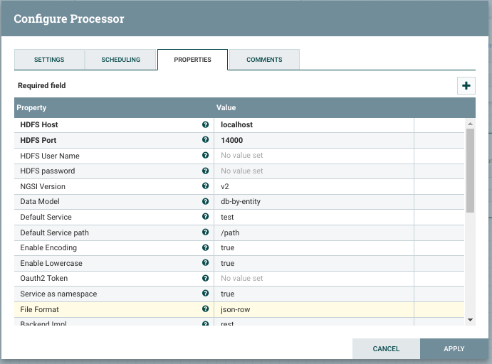

# <a name="top"></a>NGSIToHDFS
Content:

* [Functionality](#section1)
    * [Mapping NGSI events to `NGSIEvent` objects](#section1.1)
    * [Mapping `NGSIEvent`s to HDFS data structures](#section1.2)
        * [HDFS paths naming conventions](#section1.2.1)
        * [Json row-like storing](#section1.2.2)
        * [Json column-like storing](#section1.2.3)
        * [CSV row-like storing](#section1.2.4)
        * [CSV column-like storing](#section1.2.5)
        * [Hive](#section1.2.6)
    * [Example](#section1.3)
        * [`NGSIEvent`](#section1.3.1)
        * [Path names](#section1.3.2)
        * [Json row-like storing](#section1.3.3)
        * [Json column-like storing](#section1.3.4)
        * [CSV row-like storing](#section1.3.5)
        * [CSV column-like storing](#section1.3.6)
        * [Hive storing](#section1.3.7)
* [Administration guide](#section2)
    * [Configuration](#section2.1)
    * [Use cases](#section2.2)
    * [Important notes](#section2.3)
        * [About the persistence mode](#section2.3.1)
        * [About the binary backend](#section2.3.2)
        * [About batching](#section2.3.3)
        * [About the encoding](#section2.3.4)

## <a name="section1"></a>Functionality
`NGSIToHDFS` processor, or simply `NGSIToHDFS` is a sink designed to persist NGSI-like context data events within a [HDFS](https://hadoop.apache.org/docs/current/hadoop-project-dist/hadoop-hdfs/HdfsUserGuide.html) deployment. Usually, such a context data is notified by a [Orion Context Broker](https://github.com/telefonicaid/fiware-orion) instance, but could be any other system speaking the <i>NGSI language</i>.

Independently of the data generator, NGSI context data is always transformed into internal `NGSIEvent` objects at Draco sources. In the end, the information within these events must be mapped into specific HDFS data structures at the Draco sinks.

Next sections will explain this in detail.

[Top](#top)

### <a name="section1.1"></a>Mapping NGSI events to `NGSIEvent` objects
Notified NGSI events (containing context data) are transformed into `NGSIEvent` objects (for each context element a `NGSIEvent` is created; such an event is a mix of certain headers and a `ContextElement` object), independently of the NGSI data generator or the final backend where it is persisted.

This is done at the Draco-ngsi Http listeners (in Flume jergon, sources) thanks to [`NGSIRestHandler`](/ngsi_rest_handler.md). Once translated, the data (now, as `NGSIEvent` objects) is put into the internal channels for future consumption (see next section).

[Top](#top)

### <a name="section1.2"></a>Mapping `NGSIEvent`s to HDFS data structures
[HDFS organizes](https://hadoop.apache.org/docs/current/hadoop-project-dist/hadoop-hdfs/HdfsDesign.html#The_File_System_Namespace) the data in folders containing big data files. Such organization is exploited by `NGSIToHDFS` each time a `NGSIEvent` is going to be persisted.

[Top](#top)

#### <a name="section1.2.1"></a>HDFS paths naming conventions
Since the unique data model accepted for `NGSIToHDFS` is per entity (see the [Configuration](#section2.1) section for more details), a HDFS folder:

    /user/<hdfs_userame>/<fiware-service>/<fiware-servicePath>/<destination>

is created (if not existing yet) for each notified entity, where `<hdfs_username>` is a configuration parameter about a HDFS superuser, `<fiware-service>` and `<fiware-servicePath>` are notified as Http headers (or defaulted in NGSIRestHandler), and `<destination>` is the `notified_entities`/`grouped_entities` header value (depending on using or not the grouping rules, see the [Configuration](#section2.1) section for more details) within the `NGSIEvent`.

Then, for each notified entity a file named `<destination>.txt` is created (if not yet existing) under the above directory. Again, `<destination>` is the `notified_entities`/`grouped_entities` header value (depending on using or not the grouping rules, see the [Configuration](#section2.1) section for more details) within the `NGSIEvent`.

Please observe HDFS folders and files follow the [Unix rules](https://en.wikipedia.org/wiki/Filename#Reserved_characters_and_words) about allowed character set and path max length (255 characters). This leads to certain [encoding](#section2.3.4) is applied depending on the `enable_encoding` configuration parameter.

[Top](#top)

#### <a name="section1.2.2"></a>Json row-like storing
Regarding the specific data stored within the HDFS file, if `file_format` parameter is set to `json-row` (default storing mode) then the notified data is stored attribute by attribute, composing a Json document for each one of them. Each append contains the following fields:

* `recvTimeTs`: UTC timestamp expressed in miliseconds.
* `recvTime`: UTC timestamp in human-readable format ([ISO 8601](http://en.wikipedia.org/wiki/ISO_8601)).
* `fiwareServicePath`: Notified fiware-servicePath, or the default configured one if not notified.
* `entityId`: Notified entity identifier.
* `entityType`: Notified entity type.
* `attrName`: Notified attribute name.
* `attrType`: Notified attribute type.
* `attrValue`: In its simplest form, this value is just a string, but since Orion 0.11.0 it can be JSON object or JSON array.
* `attrMd`: It contains a string serialization of the metadata array for the attribute in JSON (if the attribute hasn't metadata, an empty array `[]` is inserted).

[Top](#top)

#### <a name="section1.2.3"></a>Json column-like storing
Regarding the specific data stored within the HDFS file, if `file_format` parameter is set to `json-column` then a single Json document is composed for the whole notified entity, containing the following fields:

* `recvTime`: UTC timestamp in human-readable format ([ISO 8601](http://en.wikipedia.org/wiki/ISO_8601)).
* `fiwareServicePath`: The notified one or default one.
* `entityId`: Notified entity identifier.
* `entityType`: Notified entity type.
* For each notified attribute, a field named as the attribute is considered. This field will store the attribute values along the time.
* For each notified attribute, a field named as the concatenation of the attribute name and `_md` is considered. This field will store the attribute's metadata values along the time.

[Top](#top)

#### <a name="section1.2.4"></a>CSV row-like storing
Regarding the specific data stored within the HDFS file, if `file_format` parameter is set to `csv-row` then the notified data is stored attribute by attribute, composing a CSV record for each one of them. Each record contains the following fields:

* `recvTimeTs`: UTC timestamp expressed in miliseconds.
* `recvTime`: UTC timestamp in human-readable format ([ISO 8601](http://en.wikipedia.org/wiki/ISO_8601)).
* `fiwareServicePath`: Notified fiware-servicePath, or the default configured one if not notified.
* `entityId`: Notified entity identifier.
* `entityType`: Notified entity type.
* `attrName`: Notified attribute name.
* `attrType`: Notified attribute type.
* `attrValue`: In its simplest form, this value is just a string, but since Orion 0.11.0 this can be a JSON object or JSON array.
* `attrMd`: In this case, the field does not contain the real metadata, but the name of the HDFS file storing such metadata. The reason to do this is the metadata may be an array of any length; each element within the array will be persisted as a single line in the metadata file containing the metadata's name, type and value, all of them separated by the ',' field separator. There will be a metadata file per each attribute under `/user/<hdfs_userame>/<fiware-service>/<fiware-servicePath>/<destination>_<attrName>_<attrType>/<destination>_<attrName>_<attrType>.txt`

[Top](#top)

#### <a name="section1.2.5"></a>CSV column-like storing
Regarding the specific data stored within the HDFS file, if `file_format` parameter is set to `csv-column` then a single CSV record is composed for the whole notified entity, containing the following fields:

* `recvTime`: UTC timestamp in human-readable format ([ISO 8601](http://en.wikipedia.org/wiki/ISO_8601)).
* `fiwareServicePath`: The notified one or default one.
* `entityId`: Notified entity identifier.
* `entityType`: Notified entity type.
* For each notified attribute, a field named as the attribute is considered. This field will store the attribute values along the time.
* For each notified attribute, a field named as the concatenation of the attribute name and `_md` is considered. This field will store the attribute's metadata values along the time.

[Top](#top)

#### <a name="section1.2.6"></a>Hive
A special feature regarding HDFS persisted data is the possibility to exploit it through Hive, a SQL-like querying system. `NGSIToHDFS` automatically [creates a Hive external table](https://cwiki.apache.org/confluence/display/Hive/LanguageManual+DDL#LanguageManualDDL-Create/Drop/TruncateTable) (similar to a SQL table) for each persisted entity in the default database, being the name for such tables as `<username>_<fiware-service>_<fiware-servicePath>_<destination>_[row|column]`.

The fields regarding each data row match the fields of the JSON documents/CSV records appended to the HDFS files. In the case of JSON, they are deserialized by using a [JSON serde](https://github.com/rcongiu/Hive-JSON-Serde). In the case of CSV they are deserialized by the delimiter fields specified in the table creation.

[Top](#top)

### <a name="section1.3"></a>Example
#### <a name="section1.3.1"></a>`NGSIEvent`
Assuming the following `NGSIEvent` is created from a notified NGSI context data (the code below is an <i>object representation</i>, not any real data format):

    ngsi-event={
        headers={
	         content-type=application/json,
	         timestamp=1429535775,
	         transactionId=1429535775-308-0000000000,
	         correlationId=1429535775-308-0000000000,
	         fiware-service=vehicles,
	         fiware-servicepath=/4wheels,
	         <grouping_rules_interceptor_headers>,
	         <name_mappings_interceptor_headers>
        },
        body={
	        entityId=car1,
	        entityType=car,
	        attributes=[
	            {
	                attrName=speed,
	                attrType=float,
	                attrValue=112.9
	            },
	            {
	                attrName=oil_level,
	                attrType=float,
	                attrValue=74.6
	            }
	        ]
	    }
    }

[Top](#top)

#### <a name="section1.3.2"></a>Path names
Assuming `hdfs_username=myuser` and `service_as_namespace=false` as configuration parameters, then `NGSIToHDFS` will persist the data within the body in this file (old encoding):

    $ hadoop fs -cat /user/myuser/vehicles/4wheels/car1_car/car1_car.txt

Using the new encoding:

    $ hadoop fs -cat /user/myuser/vehicles/4wheels/car1xffffcar/car1xffffcar.txt

[Top](#top)

#### <a name="section1.3.3"></a>Json row-like storing
A pair of Json documents are appended to the above file, one per attribute:

```
{"recvTimeTs":"1429535775","recvTime":"2015-04-20T12:13:22.41.124Z","fiwareServicePath":"4wheels","entityId":"car1","entityType":"car","attrName":"speed","attrType":"float","attrValue":"112.9","attrMd":[]}
{"recvTimeTs":"1429535775","recvTime":"2015-04-20T12:13:22.41.124Z","fiwareServicePath":"4wheels","entityId":"car1","entityType":"car","attrName":"oil_level","attrType":"float","attrValue":"74.6","attrMd":[]}
```

[Top](#top)

#### <a name="section1.3.4"></a>Json column-like storing
A single Json document is appended to the above file, containing all the attributes:

```
{"recvTime":"2015-04-20T12:13:22.41.124Z","fiwareServicePath":"4wheels","entityId":"car1","entityType":"car","speed":"112.9","speed_md":[],"oil_level":"74.6","oil_level_md":[]}
```

[Top](#top)

#### <a name="section1.3.5"></a>CSV row-like storing
A pair of CSV records are appended to the above file, one per attribute:

```
1429535775,2015-04-20T12:13:22.41.124Z,4wheels,car1,car,speed,float,112.9,hdfs:///user/myuser/vehicles/4wheels/car1_car_speed_float/car1_car_speed_float.txt
1429535775,2015-04-20T12:13:22.41.124Z,4wheels,car1,car,oil_level,float,74.6,hdfs:///user/myuser/vehicles/4wheels/car1_car_oil_level_float/car1_car_oil_level_float.txt
```

Please observe despite the metadata for the example above is empty, the metadata files are created anyway.

In the case the metadata for the `speed` attribute was, for instance:

    [
       {"name": "manufacturer", "type": "string", "value": "acme"},
       {"name": "installation_year", "type": "integer", "value": 2014}
    ]

then the `hdfs:///user/myuser/vehicles/4wheels/car1_car_speed_float/car1_car_speed_float.txt` file content would be:

    1429535775,manufacturer,string,acme
    1429535775,installation_year,integer,2014

[Top](#top)

#### <a name="section1.3.6"></a>CSV column-like storing
A single CSV record is appended to the above file, containing all the attributes:

```
2015-04-20T12:13:22.41.124Z,112.9,4wheels,car1,car,hdfs:///user/myuser/vehicles/4wheels/car1_car_speed_float/car1_car_speed_float.txt,74.6,hdfs:///user/myuser/vehicles/4wheels/car1_car_oil_level_float/car1_car_oil_level_float.txt}
```

Please observe despite the metadata for the example above is empty, the metadata files are created anyway.

In the case the metadata for the `speed` attribute was, for instance:

    [
       {"name": "manufacturer", "type": "string", "value": "acme"},
       {"name": "installation_year", "type": "integer", "value": 2014}
    ]

then the `hdfs:///user/myuser/vehicles/4wheels/car1_car_speed_float/car1_car_speed_float.txt` file content would be:

    1429535775,manufacturer,string,acme
    1429535775,installation_year,integer,2014

[Top](#top)

#### <a name="section1.3.7"></a>Hive storing
With respect to Hive, the content of the tables in the `json-row`, `json-column`, `csv-row` and `csv-column` modes, respectively, is:

    $ hive
    hive> select * from myuser_vehicles_4wheels_car1_car_row;
    OK
    1429535775	2015-04-20T12:13:22.41.124Z	4wheels	car1	car	speed		float	112.9	[]
    1429535775	2015-04-20T12:13:22.41.124Z	4wheels	car1	car	oil_level	float	74.6	[]
    hive> select * from myuser_vehicles_4wheels_car1_car_column;
    2015-04-20T12:13:22.41.124Z		4wheels	car1	car	112.9	[]	74.6	[]
    hive> select * from myuser_vehicles_4wheels_car1_car_row;
    OK
    1429535775	2015-04-20T12:13:22.41.124Z	4wheels	car1	car	speed		float	112.9	hdfs:///user/myuser/vehicles/4wheels/car1_car_speed_float/car1_car_speed_float.txt
    1429535775	2015-04-20T12:13:22.41.124Z	car1	car	oil_level	float	74.6	hdfs:///user/myuser/vehicles/4wheels/car1_car_oil_level_float/car1_car_oil_level_float.txt
    hive> select * from myuser_vehicles_4wheels_car1_car_column;
    2015-04-20T12:13:22.41.124Z		4wheels	car1	car	112.9	hdfs:///user/myuser/vehicles/4wheels/car1_car_speed_float/car1_car_speed_float.txt	74.6	hdfs:///user/myuser/vehicles/4wheels/car1_car_oil_level_float/car1_car_oil_level_float.txt

NOTE: `hive` is the Hive CLI for locally querying the data.

[Top](#top)

## <a name="section2"></a>Administration guide
### <a name="section2.1"></a>Configuration
`NGSIToHDFS` is configured through the following parameters:

| Name                               | Default Value | Allowable Values         | Description                                                                                        |
|---|---|---|---|
| **HDFS Host** | no | localhost | FQDN/IP address where HDFS Namenode runs, or comma-separated list of FQDN/IP addresses where HDFS HA Namenodes run. |
| **HDFS Port** | no | 14000 | <i>14000</i> if using HttpFS (rest), <i>50070</i> if using WebHDFS (rest), <i>8020</i> if using the Hadoop API (binary). |
| HDFS username | yes | N/A | If `service_as_namespace=false` then it must be an already existent user in HDFS. If `service_as_namespace=true` then it must be a HDFS superuser. |
| HDFS password | no | N/A | Password for the above `hdfs_username`; this is only required for Hive authentication. |
| **NGSI version**                   |        no     |      v2                    | list of supported version of NGSI (v2 and ld), currently only support v2                                                                                                     |
| **Data Model**                     | db-by-entity  |     db-by-entity         | The Data model for creating the Columns when an event have been received you can choose between: db-by-service-path or db-by-entity, default value is db-by-service-path      |
| **Attribute persistence**          | row           | row, column              | The mode of storing the data inside of the Column allowable values are row and column                                                                                         |
| Default Service                    | test          |                          | In case you dont set the Fiware-Service header in the context broker, this value will be used as Fiware-Service                                                              |
| Default Service path               | /path         |                          | In case you dont set the Fiware-ServicePath header in the context broker, this value will be used as Fiware-ServicePath                                                      |
| enable\_encoding | no | false | <i>true</i> or <i>false</i>, <i>true</i> applies the new encoding, <i>false</i> applies the old encoding. ||
| enable\_lowercase | no | false | <i>true</i> or <i>false</i>. |
| data\_model | no | dm-by-entity |  Always <i>dm-by-entity</i>, even if not configured. |
| file\_format | no | json-row | <i>json-row</i>, <i>json-column</i>, <i>csv-row</i> or <i>json-column</i>. |
| backend.impl | no | rest | <i>rest</i>, if a WebHDFS/HttpFS-based implementation is used when interacting with HDFS; or <i>binary</i>, if a Hadoop API-based implementation is used when interacting with HDFS. |
| backend.max\_conns | no | 500 | Maximum number of connections allowed for a Http-based HDFS backend. Ignored if using a binary backend implementation. |
| backend.max\_conns\_per\_route | no | 100 | Maximum number of connections per route allowed for a Http-based HDFS backend. Ignored if using a binary backend implementation. |
| oauth2\_token | no | N/A | OAuth2 token required for the HDFS authentication. |
| service\_as\_namespace | no | false | If configured as <i>true</i> then the `fiware-service` (or the default one) is used as the HDFS namespace instead of `hdfs_username`, which in this case must be a HDFS superuser. |
| csv\_separator | no | , ||
| batch\_size | no | 1 | Number of events accumulated before persistence. |
| batch\_timeout | no | 30 | Number of seconds the batch will be building before it is persisted as it is. |
| batch\_ttl | no | 10 | Number of retries when a batch cannot be persisted. Use `0` for no retries, `-1` for infinite retries. Please, consider an infinite TTL (even a very large one) may consume all the sink's channel capacity very quickly. |
| batch\_retry\_intervals | no | 5000 | Comma-separated list of intervals (in miliseconds) at which the retries regarding not persisted batches will be done. First retry will be done as many miliseconds after as the first value, then the second retry will be done as many miliseconds after as second value, and so on. If the batch\_ttl is greater than the number of intervals, the last interval is repeated. |
| hive | no | true | <i>true</i> or <i>false</i>. |
| hive.server\_version | no | 2 | `1` if the remote Hive server runs HiveServer1 or `2` if the remote Hive server runs HiveServer2. |
| hive.host | no | localhost ||
| hive.port | no | 10000 ||
| hive.db\_type | no | default-db | <i>default-db</i> or <i>namespace-db</i>. If `hive.db_type=default-db` then the default Hive database is used. If `hive.db_type=namespace-db` and `service_as_namespace=false` then the `hdfs_username` is used as Hive database. If `hive.db_type=namespace-db` and `service_as_namespace=true` then the notified fiware-service is used as Hive database. |
| krb5\_auth | no | false | <i>true</i> or <i>false</i>. |
| krb5\_user | no | <i>empty</i> | Ignored if `krb5_auth=false`, mandatory otherwise. |
| krb5\_password | no | <i>empty</i> | Ignored if `krb5_auth=false`, mandatory otherwise. |
| krb5\_login\_conf\_file | no | krb5_login.conf | Ignored if `krb5_auth=false`. |
| krb5\_conf\_file | no | krb5.conf | Ignored if `krb5_auth=false`. |

A configuration example could be:



[Top](#top)

### <a name="section2.2"></a>Use cases
Use `NGSIToHDFS` if you are looking for a JSON or CSV-based document storage growing in the mid-long-term in estimated sizes of terabytes for future trending discovery, along the time persistent patterns of behaviour and so on.

For a short-term historic, those required by dashboards and charting user interfaces, other backends are more suited such as MongoDB, STH Comet or MySQL (Draco provides sinks for them, as well).

[Top](#top)

### <a name="section2.3"></a>Important notes
#### <a name="section2.3.1"></a>About the persistence mode
Please observe not always the same number of attributes is notified; this depends on the subscription made to the NGSI-like sender. This is not a problem for the `*-row` persistence mode, since fixed 8-fields JSON/CSV documents are appended for each notified attribute. Nevertheless, the `*-column` mode may be affected by several JSON documents/CSV records of different lengths (in term of fields). Thus, the `*-column` mode is only recommended if your subscription is designed for always sending the same attributes, event if they were not updated since the last notification.

[Top](#top)

#### <a name="section2.3.2"></a>About the binary backend
Current implementation of the HDFS binary backend does not support any authentication mechanism.

A desirable authentication method would be OAuth2, since it is the standard in FIWARE, but this is not currently supported by the remote RPC server the binary backend accesses.

Valid authentication mechanism are Kerberos and Hadoop Delegation Token, nevertheless none has been used and the backend simply requires a username (the one configured in `hdfs_username`) in order the `Draco` user (the one running Draco) impersonates it.

Thus, it is not recommended to use this backend in multi-user environment, or at least not without accepting the risk any user may impersonate any other one by simply specifying his/her username.

There exists an [issue](https://github.com/telefonicaid/fiware-cosmos/issues/111) about adding OAuth2 support to the Hadoop RPC mechanism, in the context of the [`fiware-cosmos`](https://github.com/telefonicaid/fiware-cosmos) project.

[Top](#top)

#### <a name="section2.3.3"></a>About batching
As explained in the [programmers guide](#section3), `NGSIToHDFS` extends `NGSISink`, which provides a built-in mechanism for collecting events from the internal Flume channel. This mechanism allows extending classes have only to deal with the persistence details of such a batch of events in the final backend.

What is important regarding the batch mechanism is it largely increases the performance of the sink, because the number of writes is dramatically reduced. Let's see an example, let's assume a batch of 100 `NGSIEvent`s. In the best case, all these events regard to the same entity, which means all the data within them will be persisted in the same HDFS file. If processing the events one by one, we would need 100 writes to HDFS; nevertheless, in this example only one write is required. Obviously, not all the events will always regard to the same unique entity, and many entities may be involved within a batch. But that's not a problem, since several sub-batches of events are created within a batch, one sub-batch per final destination HDFS file. In the worst case, the whole 100 entities will be about 100 different entities (100 different HDFS destinations), but that will not be the usual scenario. Thus, assuming a realistic number of 10-15 sub-batches per batch, we are replacing the 100 writes of the event by event approach with only 10-15 writes.

The batch mechanism adds an accumulation timeout to prevent the sink stays in an eternal state of batch building when no new data arrives. If such a timeout is reached, then the batch is persisted as it is.

Regarding the retries of not persisted batches, a couple of parameters is used. On the one hand, a Time-To-Live (TTL) is used, specifing the number of retries Draco will do before definitely dropping the event. On the other hand, a list of retry intervals can be configured. Such a list defines the first retry interval, then se second retry interval, and so on; if the TTL is greater than the length of the list, then the last retry interval is repeated as many times as necessary.

By default, `NGSIToHDFS` has a configured batch size and batch accumulation timeout of 1 and 30 seconds, respectively. Nevertheless, as explained above, it is highly recommended to increase at least the batch size for performance purposes. Which are the optimal values? The size of the batch it is closely related to the transaction size of the channel the events are got from (it has no sense the first one is greater then the second one), and it depends on the number of estimated sub-batches as well. The accumulation timeout will depend on how often you want to see new data in the final storage. A deeper discussion on the batches of events and their appropriate sizing may be found in the [performance document](https://github.com/telefonicaid/fiware-Draco/blob/master/doc/Draco-ngsi/installation_and_administration_guide/performance_tips.md).

[Top](#top)

#### <a name="section2.3.4"></a>About the encoding
Until version 1.2.0 (included), Draco applied a very simple encoding:

* All non alphanumeric characters were replaced by underscore, `_`.
* The underscore was used as concatenator character as well.
* The slash, `/`, in the FIWARE service paths is ignored.

From version 1.3.0 (included), Draco applies this specific encoding tailored to HDFS data structures:

* Alphanumeric characters are not encoded.
* Numeric characters are not encoded.
* Equals character, `=`, is encoded as `xffff`.
* User defined strings composed of a `x` character and a [Unicode](http://unicode-table.com) are encoded as `xx` followed by the Unicode.
* Slash character, `/`, is encoded as `x002f`.
* All the other characters are not encoded.
* `xffff` is used as concatenator character.

Despite the old encoding will be deprecated in the future, it is possible to switch the encoding type through the `enable_encoding` parameter as explained in the [configuration](#section2.1) section.

[Top](#top)


