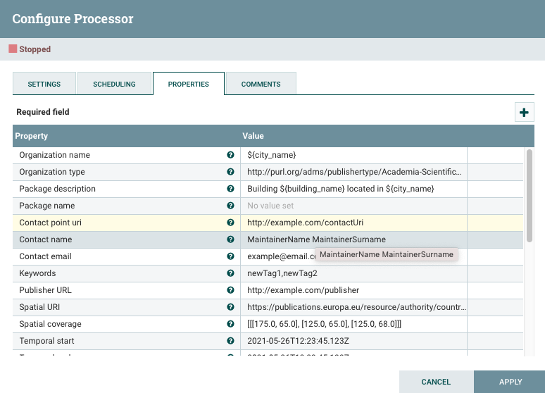
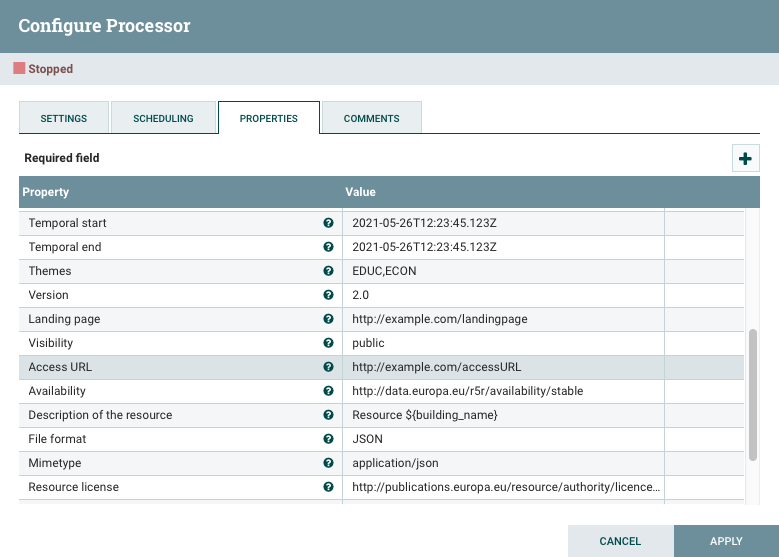
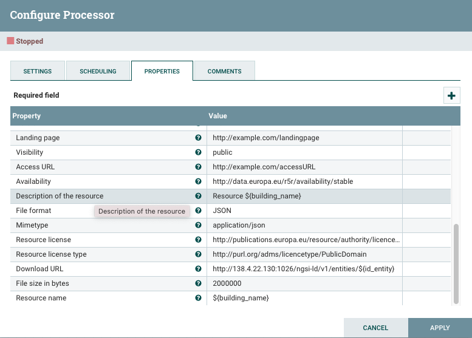

# UpdateCKANMetadata <!-- omit in toc -->
Content:

-   [Functionality](#section1)
-   [Mapping NGSI-LD events to `NGSI-LDEvent` objects](#section1.1)
-   [Mapping `NGSI-LDEvents` to DCAT-AP Metadata into CKAN data structures](#section1.2)
    -   [DCAT-AP Metadata tags for Organizations](#section1.2.1)
    -   [DCAT-AP Metadata tags for Packages/Datasets](#section1.2.2)
    -   [DCAT-AP Metadata tags for Resources](#section1.2.3)
-   [Administration guide](#section2)
    -   [Configuration](#section2.1)
-   [Use cases](#section2.2)
-   [Programmers guide](#section3)
    -   [`UpdateCKANMetadata` class](#section3.1)

## Functionality
`UpdateCKANMetadata`, is a processor designed to add additional metadata to an incoming flowfile or NGSI-LD event. This processor was designed to include all the metadata fields needed for complying with [DCAT-AP v2.0.1](https://joinup.ec.europa.eu/collection/semantic-interoperability-community-semic/news/dcat-ap-release-201) 
 This processor is intended to be used joined with the `NGSIToCKAN` processor for persist NGSI-LD-like context data events and DCAT-AP metadata within a [CKAN](http://ckan.org/) server. Usually, such a context data is notified by a
Context Broker ([Orion Context Broker](https://github.com/telefonicaid/fiware-orion),[Orion-LD Context Broker](https://github.com/FIWARE/context.Orion-LD),[Scorpio Broker](https://github.com/ScorpioBroker/ScorpioBroker) ) instance, but could be any other system speaking the _NGSI language_.

Independently of the data generator, NGSI-LD context data is always transformed into internal `NGSI-LDEvent` objects at Draco sources. In the end, the information within these events must be mapped into specific CKAN data and metadata structures.

Next sections will explain this in detail.

[Top](#top)

### Mapping NGSI-LD events to `NGSI-LDEvent` objects
Notified NGSI-LD events (containing context data) are transformed into `NGSI-LDEvent` objects (for each context element a `NGSI-LDEvent` is created; such an event is a mix of certain headers and a `ContextElement` object), independently of the NGSI-LD data generator or the final backend where it is persisted.

This is done at the Draco-NGSI HTTP listeners (in NiFi, processors) thanks to NGSIRestHandler. Once translated, the data (now, as NGSIEvent objects) is put into the internal channels for future consumption (see next section).
[Top](#top)

### Mapping `NGSI-LDEvent`s to DCAT-AP Metadata into CKAN data structures
[CKAN](http://docs.ckan.org/en/latest/user-guide.html) organizes the data in organizations containing packages or datasets; each one of these packages/datasets contains several resources whose data is finally stored in a PostgreSQL database (CKAN Datastore) or plain files (CKAN Filestore). Such organization is exploited by `NGSIToCKAN` each time a `NGSI-LDEvent` is going to be persisted.
Additionally, metadata could be included and some of this metadata could be used for building the organization, packages/datasets and resources names.
Due to this processor only add the metadata to CKAN, it is needed the work with the NGSIToCKAN processor in order to perform all the operations in CKAN, the name conventions remains the same like is described in [NGSIToCKAN processor](./ngsi_ckan_sink.md). 

DCAT-AP v2.0.1 specification defines some mandatory tags in metadata for complying with this specification, accordingly, the ´UpdateCKANMetadata´ processor defines a set of properties to be included in order to provide this metadata. This properties are described in the following tables:

#### DCAT-AP Metadata tags for Organizations 
| DCAT-AP Property | NGSI    | UpdateCKANMetadata | NGSIToCKAN                                      | CKAN                                      | DCAT-AP 2.0.1                  |
| ---------------- | ------- | ------------------ | ----------------------------------------------- | ----------------------------------------- | ------------------------------ |
|                  | \-      |                    |                                                 | ID (autogenerated)                        |                                |
| foaf:name        | service | organizationName   | organizationName || service || DEFAULT\_SERVICE | title                                     | Mandatory property for Agent   |
| dct:type         | \-      | organizationType   | organizationType                                | extra:publisher\_type (passed in package) | Recommended property for Agent |
#### DCAT-AP Metadata tags for Packages/Datasets
| DCAT-AP Property  | NGSI                                       | UpdateCKANMetadata                                                  | NGSIToCKAN                                                                          | CKAN                           | DCAT-AP 2.0.1                  |
| ----------------- | ------------------------------------------ | ------------------------------------------------------------------- | ----------------------------------------------------------------------------------- | ------------------------------ | ------------------------------ |
| dct:identifier    | \-                                         | \-                                                                  | \-                                                                                  | ID (autogenerated)             | Optional property for Dataset     |
| dcat:Dataset      |                                            |                                                                     |                                                                                     |   
| dct:description   | \-                                         | packageDescription                                                  | packageDescription                                                                  | notes                          | Mandatory property for Dataset   |
| dct:title         | service                                    | packageName (expression language to dates)                          | (packageName || service || DEFAULT\_SERVICE) -> (if ld && dataModel = db-by-entity) | title                          | Mandatory property for Dataset   |
| entity ID         | packageName (expression language to dates) | (packageName || entity id) -> (if ld &&dataModel = db-by-entity-id) |
| dcat:contactPoint | \-                                         | contactPoint                                                        | contactPoint + contactName + contactEmail                                           | extra:contact\_uri             | Recommended property for Dataset |
| \-                | contactName                                | extra:contact\_name                                                 |
| \-                | contactEmail                               | extra:contact\_email                                                |
| dcat:distribution | \-                                         | \-                                                                  | \-                                                                                  | ID of distribution (resource)  | Recommended property for Dataset |
| dcat:keyword      | \-                                         | keywords                                                            | keywords                                                                            | tags                           | Recommended property for Dataset |
| dct:publisher     | \-                                         | \-                                                                  | publisherURL (or autogenerated)                                                     | ID of publisher (organization) | Recommended property for Dataset |
| publisherURL      |
| dct:spatial       | \-                                         | spatialURI                                                          | spatialURI                                                                          | extra:spatial\_uri             | Recommended property for Dataset |
|  |
| \-                | spatialCoverage                            | spatialCoverage                                                     | extra:spatial                                                                       |
| \-                | spatialCoverage                            | spatialCoverage                                                     | extra:spatial                                                                       |
| dct:temporal      | \-                                         | temporalStart                                                       | temporalStart                                                                       | extra:temporal\_start          | Recommended property for Dataset |
| \-                | temporalEnd                                | temporalEnd                                                         | extra:temporal\_end                                                                 |
| dcat:theme        | \-                                         | themes                                                              | themes                                                                              | extra:theme                    | Recommended property for Dataset |
| dcat:landingPage  | \-                                         | landingPage                                                         | landingPage                                                                         | URL                            | Optional property for Dataset    |
| dct:accessRights  | \-                                         | datasetRights                                                         | datasetRights                                                                         | extra:access_rights                            | Optional property for Dataset    |
| owl:versionInfo   | \-                                         | version                                                             | version                                                                             | extra:dcat_version             | Optional property for Dataset    |

#### DCAT-AP Metadata tags for Resources
| DCAT-AP Property    |  NGSI       | UpdateCKANMetadata     | NGSIToCKAN                               | CKAN                               | DCAT-AP 2.0.1                           |
| ------------------- | ----------- | ---------------------- | ---------------------------------------- | ---------------------------------- | ------------------------------------- |
|                     |             |                        |                                          |                                    |                                       |
| dcat:Distribution   | \-          | \-                     | \-                                       | `resource:id` (autogenerated)        |                                       |
| dcat:accessURL      | \-          | accessURL              | accessURL or autogenerate: datastore URL | `resource:access\_url`               | Mandatory property for Distribution   |
| dcatap:availability |             | availability           | availability                             | resource:availability (not exists) | Recommended property for Distribution |
| dct:description     | \-          | resourceDescription    | resourceDescription                      | resource:description               | Recommended property for Distribution |
| dct:format          | \-          | format                 | format or JSON                           | resource:format                    | Recommended property for Distribution |
| dcat:mediaType      | \-          | mimetype               | mimetype                                 | resource:mimetype                  |
| dct:license         | \-          | license                | license                                  | resource:license                   | Recommended property for Distribution |
| licenseType         | licenseType | resource:license\_type |
| dcat:byteSize       | \-          | byteSize               | byteSize                          | resource:size                      | Optional property for Distribution    |
| dcat:downloadURL    | \-          | downloadURL            | downloadURL                       | `resource:download\_url`             | Optional property for Distribution    |
| dct:rights    | \-          | resourceRights            | resourceRights                       | `resource:rights             | Optional property for Distribution    |
| dct:title           | entity ID, entity ID + entity type               | resourceName (expression language for dates) | (resourceName or entity ID) -> (if ld && dataModel = db-by-entity-id) ,  (resourceName or entity ID + entity type) -> (if ld && dataModel = db-by-entity) | resource:name   | Optional property for Distribution |

[Top](#top)

## Administration guide
### Configuration
`NGSIToCKAN` is configured through the following parameters:

| Name                         | Allowable Values                                                                                                                                                                                                                                                                                                                                                                                                       | Description                                                                                                                                                                                                                                                                                                                                                                                                                                                                                                                                                                                                                                                                                                 |
| ---------------------------  |------------------------------------------------------------------------------------------------------------------------------------------------------------------------------------------------------------------------------------------------------------------------------------------------------------------------------------------------------------------------------------------------------------------------|-------------------------------------------------------------------------------------------------------------------------------------------------------------------------------------------------------------------------------------------------------------------------------------------------------------------------------------------------------------------------------------------------------------------------------------------------------------------------------------------------------------------------------------------------------------------------------------------------------------------------------------------------------------------------------------------------------------|
| Organization name            |                                                                                                                                                                                                                                                                                                                                                                                                                        | Organization name. Example: exampleorg **Supports Expression Language: true (will be evaluated using flow file attributes and variable registry)**                                                                                                                                                                                                                                                                                                                                                                                                                                                                                                                                                       |
| Organization type            |                                                                                                                                                                                                                                                                                                                                                                                                                        | Organization name. Example: `http://purl.org/adms/publishertype/Academia-ScientificOrganisation` **Supports Expression Language: true (will be evaluated using flow file attributes and variable registry)**                                                                                                                                                                                                                                                                                                                                                                                                                            |
| Package description          |                                                                                                                                                                                                                                                                                                                                                                                                                        | Package description. Example: Description example of dataset test **Supports Expression Language: true (will be evaluated using flow file attributes and variable registry)**                                                                                                                                                                                                                                                                                                                                                                                                                                                                                                                            |
| Package name               |                                                                                                                                                                                                                                                                                                                                                                                                                        | Organization name. Example: exampledataset **Supports Expression Language: true (will be evaluated using flow file attributes and variable registry)**                                                                                                                                                                                                                                                                                                                                                                                                                                                                                                                                                   |
| Contact point uri           |                                                                                                                                                                                                                                                                                                                                                                                                                        | Contact point. Example: `http://example.com/ContactUri` **Supports Expression Language: true (will be evaluated using flow file attributes and variable registry)**                                                                                                                                                                                                                                                                                                                                                                                                                                                                                                          |
| Contact name                |                                                                                                                                                                                                                                                                                                                                                                                                                        | Contact name. Example: MaintainerName ExampleSurname **Supports Expression Language: true (will be evaluated using flow file attributes and variable registry)**                                                                                                                                                                                                                                                                                                                                                                                                                                                                                                                                         |
| Contact email              |                                                                                                                                                                                                                                                                                                                                                                                                                        | Contact email. Example: maintainer@email.com **Supports Expression Language: true (will be evaluated using flow file attributes and variable registry)**                                                                                                                                                                                                                                                                                                                                                                                                                                                                                                                                                 |
| Keywords                   |                                                                                                                                                                                                                                                                                                                                                                                                                        | A comma delimited list of keywords. Example: newTag1,newTag2 **Supports Expression Language: true (will be evaluated using flow file attributes and variable registry)**                                                                                                                                                                                                                                                                                                                                                                                                                                                                                                                                 |
| Publisher URL               |                                                                                                                                                                                                                                                                                                                                                                                                                        | The publisher URL, it is recommended to use the controlled vocabulary proposed by the DCAT-AP `http://publications.europa.eu/resource/authority/corporate-body`. Example:`http://example.com/publisher` **Supports Expression Language: true (will be evaluated using flow file attributes and variable registry)**                                                                                                                                                                                                                                                                                          |
| Spatial URI                 |                                                                                                                                                                                                                                                                                                                                                                                                                        | The spatial URI coverage, it is recommended to use the controlled vocabularies [https://publications.europa.eu/resource/authority/country/ESP](https://publications.europa.eu/resource/authority/country/ESP), [http://publications.europa.eu/resource/authority/country](http://publications.europa.eu/resource/authority/country), [http://publications.europa.eu/resource/authority/place/](http://publications.europa.eu/resource/authority/place/) Example: [https://publications.europa.eu/resource/authority/country/ESP](https://publications.europa.eu/resource/authority/country/ESP) **Supports Expression Language: true (will be evaluated using flow file attributes and variable registry)** |
| Spatial coverage             |                                                                                                                                                                                                                                                                                                                                                                                                                        | The spatial coverage. It could be a Point or a set of Points (a POLIGON). If it is a Point the coordinaes sepparated by comma inside brackets. If it is a set of Points (polygon) the points separated by comma inside two blocks of brackets Example1: \[175.0, 17.5\]Example2: \[\[\[175.0, 17.5\], \[-65.5, 17.5\], \[-80.5, 10.5\]\]\] **Supports Expression Language: true (will be evaluated using flow file attributes and variable registry)**                                                                                                                                                                                                                                                   |
| Temporal start               |                                                                                                                                                                                                                                                                                                                                                                                                                        | Temporal coverage start in format yyyy-MM-dd-THH:mm:ss.SSSZ Example: 2021-05-25T15:01:07.173 **Supports Expression Language: true (will be evaluated using flow file attributes and variable registry)**                                                                                                                                                                                                                                                                                                                                                                                                                                                                                                 |
| Temporal end              |                                                                                                                                                                                                                                                                                                                                                                                                                        | Temporal coverage end in format yyyy-MM-dd-THH:mm:ss.SSSZ Example: 2021-05-25T15:01:07.173 **Supports Expression Language: true (will be evaluated using flow file attributes and variable registry)**                                                                                                                                                                                                                                                                                                                                                                                                                                                                                                   |
| Themes                      |                                                                                                                                                                                                                                                                                                                                                                                                                        | A comma delimited list of themes. It is recommended to select them from the controlled vocabulary [http://publications.europa.eu/resource/authority/data-theme](http://publications.europa.eu/resource/authority/data-theme). Example:[http://publications.europa.eu/resource/authority/data-theme/ECON](http://publications.europa.eu/resource/authority/data-theme/ECON), [http://publications.europa.eu/resource/authority/data-theme/EDUC](http://publications.europa.eu/resource/authority/data-theme/EDUC) **Supports Expression Language: true (will be evaluated using flow file attributes and variable registry)**                                                                                |
| Version                     |                                                                                                                                                                                                                                                                                                                                                                                                                        | Version. Example: 2.0 **Supports Expression Language: true (will be evaluated using flow file attributes and variable registry)**                                                                                                                                                                                                                                                                                                                                                                                                                                                                                                                                                                        |
| Landing page                |                                                                                                                                                                                                                                                                                                                                                                                                                        | Landing page of the packageExample: `http://example.com/landing\_page` **Supports Expression Language: true (will be evaluated using flow file attributes and variable registry)**                                                                                                                                                                                                                                                                                                                                                                                                                                                                                        |
| Visibility                  | public, private                                                                                                                                                                                                                                                                                                                                                                                                        | dataset visibility public or private                                                                                                                                                                                                                                                                                                                                                                                                                                                                                                                                                                                                                                                                        |
| Access URL                  |                                                                                                                                                                                                                                                                                                                                                                                                                        | The access URL, Example: `http://example.com/access\_url` **Supports Expression Language: true (will be evaluated using flow file attributes and variable registry)**                                                                                                                                                                                                                                                                                                                                                                                                                                                                                                       |
| Availability                | [http://data.europa.eu/r5r/availability/available](http://data.europa.eu/r5r/availability/available), [http://data.europa.eu/r5r/availability/experimental](http://data.europa.eu/r5r/availability/experimental), [http://data.europa.eu/r5r/availability/stable](http://data.europa.eu/r5r/availability/stable), [http://data.europa.eu/r5r/availability/temporary](http://data.europa.eu/r5r/availability/temporary) | Package availability, it is recommended to use the controlled vocabulary proposed by the DCAT-AP [https://www.dcat-ap.de/def/plannedAvailability/1_0](https://www.dcat-ap.de/def/plannedAvailability/1_0). Example: [http://dcat-ap.de/def/plannedAvailability/stable](http://dcat-ap.de/def/plannedAvailability/stable)                                                                                                                                                                                                                                                                                                                                                                                  |
| Description of the resource  |                                                                                                                                                                                                                                                                                                                                                                                                                        | Description of the resource. Example: Example description of example resource **Supports Expression Language: true (will be evaluated using flow file attributes and variable registry)**                                                                                                                                                                                                                                                                                                                                                                                                                                                                                                                |
| File format               | JSON, HTMl, JPEG, GeoJSON, etc. See processors usage guide to more details                                                                                                                                                                                                                                                                                                                                             | Resource format. Example: JSON                                                                                                                                                                                                                                                                                                                                                                                                                                                                                                                                                                                                                                                                              |
| Mimetype               | application/atom+xml, application/geo+json, application/gzip, application/json, application/msword etc. See processors usage guide to more details                                                                                                                                                                                                                                                                     | Resource media type. Example: application/json                                                                                                                                                                                                                                                                                                                                                                                                                                                                                                                                                                                                                                                              |
| Resource license       |                                                                                                                                                                                                                                                                                                                                                                                                                        | Resource license, it is recommended to use one from Creative Commons [http://creativecommons.org/licenses/](http://creativecommons.org/licenses/), and inparticular the CC Zero Public Domain Dedication [http://creativecommons.org/publicdomain/zero/1.0/](http://creativecommons.org/publicdomain/zero/1.0/) Example: [https://creativecommons.org/publicdomain/zero/1.0/](https://creativecommons.org/publicdomain/zero/1.0/) **Supports Expression Language: true (will be evaluated using flow file attributes and variable registry)**                                                                                                                                                               |
| Resource license type  |                                                                                                                                                                                                                                                                                                                                                                                                                        | It is recommended to use a license type from the controlled vocabulary proposed by the DCAT-AP `http://purl.org/adms/licencetype/`. Example: `http://purl.org/adms/licencetype/PublicDomain` **Supports Expression Language: true (will be evaluated using flow file attributes and variable registry)**                                                                                                                                                                                                                                                                                                                  |
| Download URL          |                                                                                                                                                                                                                                                                                                                                                                                                                        | The download URL. Example: `http://example.com/download\_url` **Supports Expression Language: true (will be evaluated using flow file attributes and variable registry)**                                                                                                                                                                                                                                                                                                                                                                                                                                                                                                 |
| File size in bytes     |                                                                                                                                                                                                                                                                                                                                                                                                                        | Number of bytes that occupies a file Example: 200000000 **Supports Expression Language: true (will be evaluated using flow file attributes and variable registry)**                                                                                                                                                                                                                                                                                                                                                                                                                                                                                                                                      |
| Resource name          |                                                                                                                                                                                                                                                                                                                                                                                                                        | Resource nameExample: resourceName **Supports Expression Language: true (will be evaluated using flow file attributes and variable registry)  **                                                                                                                                                                                                                                                                                                                                                                                                                                                                                                                                                   |

A configuration example could be:

   
[Top](#top)

## Programmers guide
### `UpdateCKANMetadata` class

[Top](#top)
