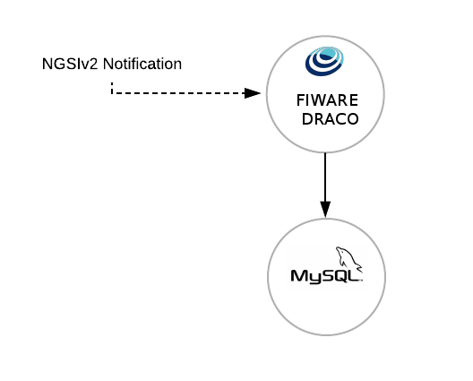
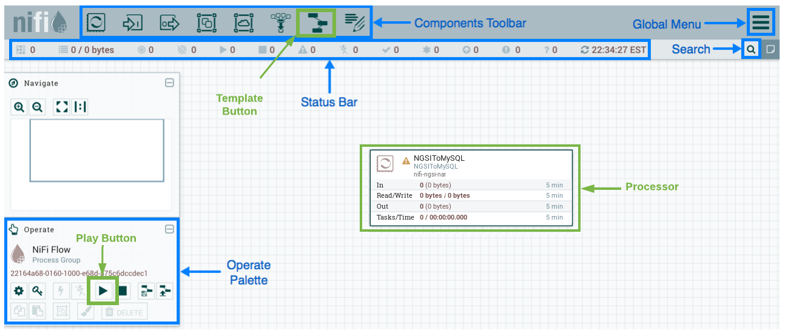
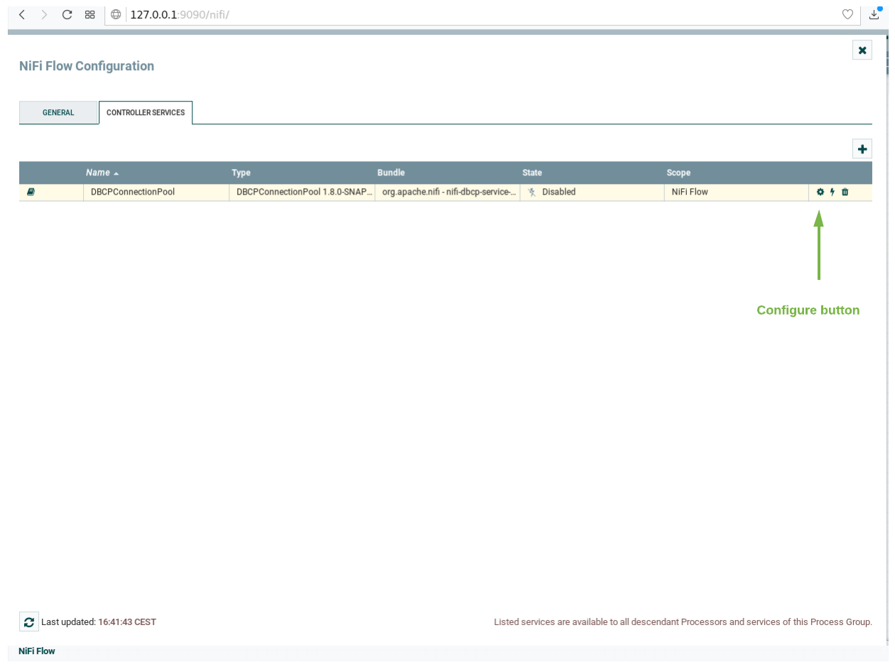
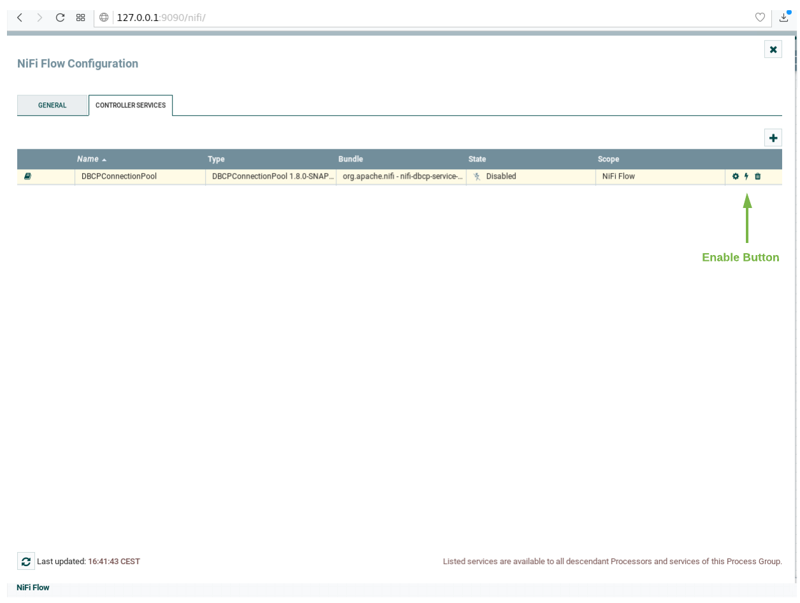
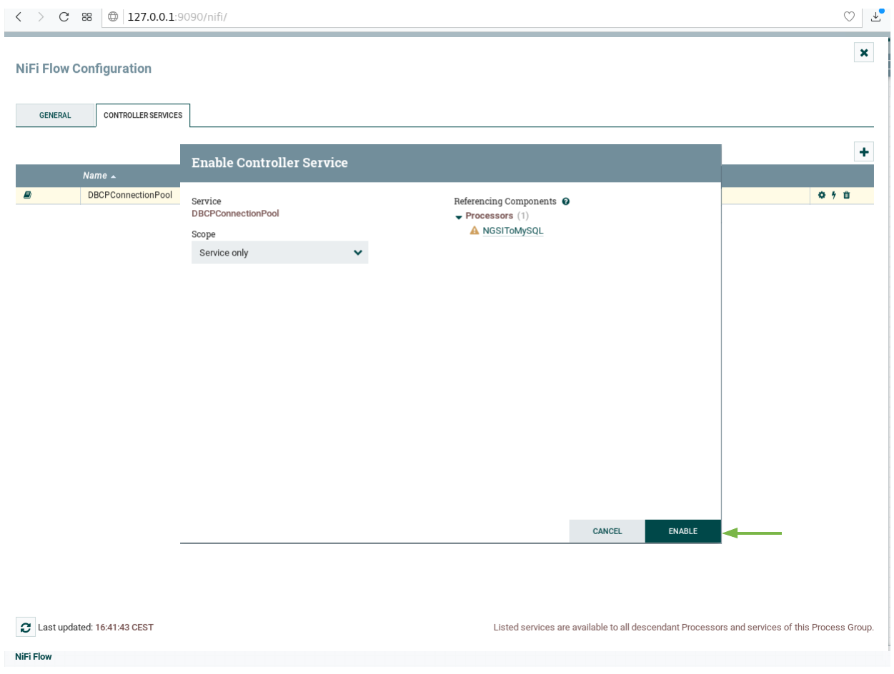
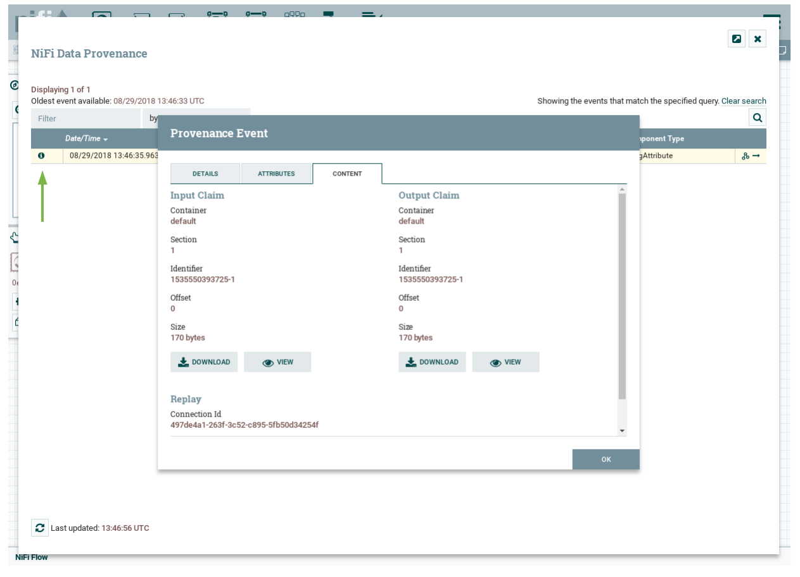

# Draco Quick Start Guide

This quick start overviews the steps a newbie programmer will have to follow in order to get familiar with Draco and its
basic functionality. For more detailed information, please refer to the [README](index.md); the
[Installation and Administration Guide](./installation_and_administration_guide/introduction.md) and the
[Processors Catalogue](processors_catalogue/introduction.md) fully document Draco.

## Scenario

The scenario presented in this guide is composed by two containers. One for running Draco and another for running MYSQL.



<a name="section1"></a>

## Before starting

The aim of this document is providing an easy guide to setup FIWARE Draco and other containers for storing context data.
In this guide we will run a basic example of Draco for storing NGSIv2 events to MySQL.

Obviously, you will need docker and docker-compose installed and running in you machine. Please, check
[this](https://docs.docker.com/linux/started/) official start guide.

<a name="section2"></a>

## Getting an image

<a name="section2.1"></a>

### Building from sources

(1) Start by cloning the `fiware-Draco` repository:

```bash
git clone https://github.com/ging/fiware-draco.git
cd fiware-draco
```

Change directory:

```bash
cd nifi-ngsi-resources/docker
```

And run the following command:

```bash
sudo docker-compose up -d
```

Once finished (it may take a while) the console will display the logs of each container.

If you want, you can open another terminal and check the available images at your docker by typing:

```text
sudo docker images
REPOSITORY          TAG                 IMAGE ID            CREATED             VIRTUAL SIZE
draco              latest              6a9e16550c82        10 seconds ago      462.1 MB
mysql               latest              273a1eca2d3a        2 weeks ago         194.6 MB
```

(2) Once you have your containers up and running, you can add the template provided for persisting data to MySQL.

First, go to your browser and open Draco using this URL `https://localhost:9090/nifi/` using the following credentials in the login page:
- `user: admin`
- `password: pass1234567890`

The next image provides you the location of many components of Draco. Please put special attention to the template
button, play button and processor component, you will use them later.


Now go to the Components toolbar which is placed in the upper section of the NiFi GUI, find the template icon and drag
and drop it inside the Draco user space. At this point, a popup should be displayed with a list of all the templates
available. Please select the template Orion-To-Mysql.

The Orion-To-Mysql template contains three processors. The first processor opens a connection for getting NGSIv2
notifications through the 5050 port. On the other hand, the second processor called NGSIToMySQL is in charge to get the
NGSIv2 events and persist that data into the MySQL database. The third is an optional processor for storing the logs of
the received events.


Before starting the processors, you need to set your MySQL password and enable the DBCConnectionPool controller. For
doing that please follow the instructions:

1.  Do right click on any part of the Draco GUI user space, and then click on configure.
    

2.  Go to the Controller Services Tab, at this point a list of controllers should be displayed, locate the
    DBCConnectionPool controller.

3.  Click on the configuration button of the "DBCPConnectionPool" 

4.  Go to the controller Properties tab and put "example" in the password field, then apply the changes.
    

5.  Enable the processor by clicking on the thunder icon and then click on enable, then close the controller
    configuration page.  

6.  Select all the processors (press shift and click on every processor) and start them by clicking on the start button.
    Now, you can see that the status icon of each processor turned from red to green.

Now for test your deployment, you may send a NGSI-like notification emulation to our listening port (5050) and path
(v2/notify):

(3) Open a new terminal and create and edit somewhere a `notification.sh` file:

```bash
touch notification.sh
```

Copy and paste this content to the notification.sh file

```bash
URL=$1

curl $URL -v -s -S --header 'Content-Type: application/json; charset=utf-8' --header 'Accept: application/json' --header "Fiware-Service: qsg" --header "Fiware-ServicePath: test" -d @- <<EOF
{
	"subscriptionId": "51c0ac9ed714fb3b37d7d5a8",
	"data": [{
		"temperature": {
			"type": "Float",
			"value": 30.73,
			"metadata": {}
		},
		"type": "Room",
		"id": "Room1"
	}]
}
EOF
```

This script will emulate the sending of an Orion notification to the URL endpoint passed as argument. The above
notification is about and entity named `Room1` of type `Room` belonging to the FIWARE service `qsg` and the FIWARE
service path `test`; it has a single attribute named `temperature` of type `float`.

(4) Give execution permissions to `notification.sh` and run it, passing as argument the URL of the listening
`HTTPSource`:

```bash
chmod a+x notification.sh
./notification.sh http://localhost:5050/v2/notify
```

(5) (Optional) If you want to see the events received, select the Log Attribute processor, do right click and select
"view data provenance"  Finally, you can see the details of the received data by
clicking on the information icon for each event of the list. 

(6) You can check if the database and the table has been created. First enter to the MySQL container console.

```bash
sudo docker exec -it mysql /bin/bash
```

Then check the created databases and his tables. For logging to mysql use "root" as user and "example" as password.

```bash
$ mysql -u root -p
mysql> show databases;
```

output:

```text
+--------------------+
| Database           |
+--------------------+
| information_schema |
| mysql              |
| performance_schema |
| qsg                |
| sys                |
+--------------------+
5 rows in set (0.06 sec)

```

```bash
mysql> use qsg;
mysql> show tables;
```

output:

```text
+---------------+
| Tables_in_qsg |
+---------------+
| test          |
+---------------+
1 row in set (0.09 sec)

```

```bash
mysql> select * from test;
```

output:

```text
+---------------+---------------------+-------------------+----------+------------+-------------+----------+-----------+--------+
| recvTimeTs    | recvTime            | fiwareServicePath | entityId | entityType | attrName    | attrType | attrValue | attrMd |
+---------------+---------------------+-------------------+----------+------------+-------------+----------+-----------+--------+
| 1535550393717 | 08/29/2018 13:46:33 | test              | Room1    | Room       | temperature | Float    | 30.73     | []     |
+---------------+---------------------+-------------------+----------+------------+-------------+----------+-----------+--------+
1 row in set (0.05 sec)

```

Now you can receive NGSIv2 notifications from Orion Context Broker and store the data into MySQL using Draco.

## Reporting issues and contact information

There are several channels suited for reporting issues and asking for doubts in general. Each one depends on the nature
of the question:

-   Use [stackoverflow.com](http://stackoverflow.com) for specific questions about this software. Typically, these will
    be related to installation problems, errors and bugs. Development questions when forking the code are welcome as
    well. Use the `fiware-Draco` tag.
-   Use [ask.fiware.org](https://ask.fiware.org/questions/) for general questions about FIWARE, e.g. how many cities are
    using FIWARE, how can I join the accelarator program, etc. Even for general questions about this software, for
    instance, use cases or architectures you want to discuss.
-   Personal email:
    -   [jamunoz@dit.upm.es](mailto:jamunoz@dit.upm.es) **Main contributor**
    -   [jsalvachua@upm.es](mailto:jsalvachua@upm.es) **Contributor**

**NOTE**: Please try to avoid personaly emailing the contributors unless they ask for it. In fact, if you send a private
email you will probably receive an automatic response enforcing you to use [stackoverflow.com](http://stackoverflow.com)
or [ask.fiware.org](https://ask.fiware.org/questions/). This is because using the mentioned methods will create a public
database of knowledge that can be useful for future users; private email is just private and cannot be shared.
